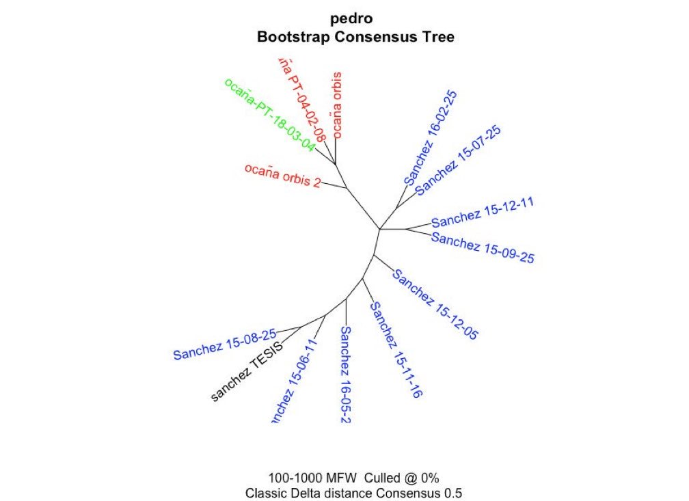
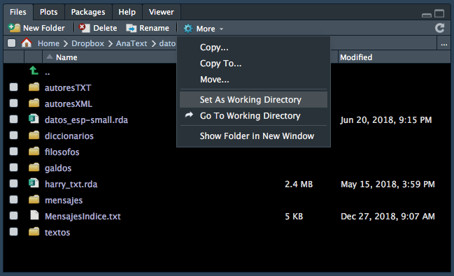
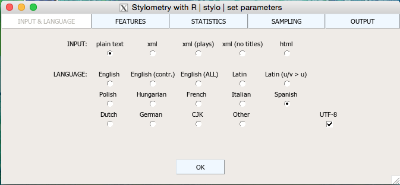
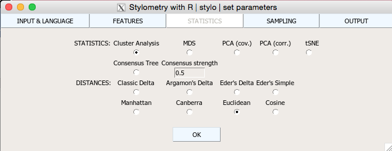
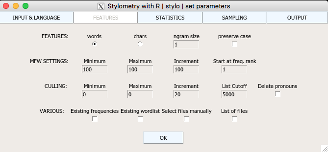

```{r setup, include=FALSE}
knitr::opts_chunk$set(echo = TRUE)
```

# Análisis atribución de autoría

## Introducción
La **estilometría** es el análisis estadístico de los textos literarios. Sin embargo, para muchos se ha convertido en un sinónimo de los análisis de atribución de autoría. Este es uno de los problemas que más tinta hace correr y que se remonta a una vieja discusión académica: la llamada [_Shakespeare authorship question_](https://en.wikipedia.org/wiki/Shakespeare_authorship_question), o lo que es lo mismo: si Shakespeare escribió Shakespeare. Es un debate que surgió a mediados del siglo XIX y cuanta con cuatro candidatos básicos posibles:

* Edward de Vere, 17 Conde de Oxford
* Francis Bacon
* Christopher Marlowe y
* William Stanley, 6 Conde de Derby.

La primera aproximación al problema fue la de Mendenhall, reflejada en su artículo [«A Mechanical solution of a literary problem»](https://en.wikisource.org/wiki/Popular_Science_Monthly/Volume_60/December_1901/A_Mechanical_Solution_of_a_Literary_Problem). La solución mecánica consistió en contar las letras de cada una de las palabras de las obras de Shakespeare y comparar la longitud de las palabras de las obras atribuidas a Shakespeare con los sospechosos habituales.
El procedimiento era muy sencillo: una persona leía una palabra, contaba el número de letras y lo anunciaba en voz alta; otra apretaba el botón adecuado (uno para cada número) en una máquina registradora construida al efecto. Procedieron así a lo largo de dos millones de palabras (400000 eran de Shakespeare). La conclusión a la que llegaron era que la longitud de palabra más usual en Shakespeare era de cuatro letras, «a thing never met with before» (Mendenhall 1901, 102).

El laborioso procedimiento de Mendenhall debió influir en que nadie se ocupara de los problemas de estilometría hasta principios de la década de 1960 con el llamado caso de los _Federalist Papers_.


## Los _Federalist Papers_

Los [_Federalist Papers_](https://es.wikipedia.org/wiki/The_Federalist_Papers) es una serie de 85 artículos y ensayos que fueron publicados anónimamente, bajo el seudónimo Publius, para persuadir a los norteamericanos de que ratificaran la nueva constitución. Se sabe que los escribieron Alexander Hamilton, James Madison y John Jay. Sin embargo, doce de ellos los reclamaban como propios Hamilton y Madison. Dos estadistas norteamericanos, Mosteller y Wallace (1964), basándose en la frecuencia de uso de palabras gramaticales, _function words_, como artículos, conjunciones y preposiciones como discriminadores de estilo establecieron la autoría de cada uno de los doce ensayos disputados. Así, pudieron ver, por ejemplo, que la preposición _upon_ aparecía 3.24 veces por cada 1000 palabras en los escritos de Hamilton frente a 0.23 en los de Madison. En cambio, este prefería la palabra _whilst_ frente _while_, que era la favorecida por Hamilton (0.47) pero inexistente en Hamilton (0), y, por el contrario, Hamilton usaba _enough_ (0.59) frente a la ausencia en Madison (0).

Esto llevó a la constatación de que pueden ser mucho más interesantes las palabras gramaticales ([Halleleeck](https://cvc.cervantes.es/ensenanza/biblioteca_ele/aepe/pdf/boletin_34-35_18_86/boletin_34-35_18_86_24.pdf)), las _function words_, las que borrábamos al considerarlas vacías, que las semánticas para establecer la huella lingüística de un autor porque las gramaticales no dependen del contexto, del tema ni del género y, además, las palabras gramaticales se usan de manera inconsciente, con lo que son más capaces de atrapar las selecciones estilísticas de los diferentes autores, aunque se puede jugar con muchos marcadores de estilo como la longitud de palabras, de las oraciones, las palabras gramaticales, distribución de letras, colocaciones, etc.


## Casos de autoría de un verano pasado

El verano de 2018 fue prolífico en el planteamiento de problemas de autoría. Hubo dos casos: uno en España y otro en Estados Unidos.

El 5 de septiembre el The New York Times publicó un artículo de opinión titulado [«I'm Part of the Resistence Inside the Trump Administration»](https://www.nytimes.com/2018/09/05/opinion/trump-white-house-anonymous-resistance.html). El problema es que, por primera vez en la historia, esta cabecera norteamericana publicaba un artículo de opinión anónimo. La consecuencia inmediata fue que una legión de comentaristas se lanzó a la caza del posible autor. Algunos vieron que se usaba la palabra _lodestar_ y por ese simple dato se le atribuyó al vicepresidente Mike Pence. Otros, con otros rasgos, siempre léxicos, se lo han atribuido a otros cargos de la administración Trump. Es muy difícil saber quién pudo ser el autor: el elenco de candidatos es muy extenso y obtener muestras de escritos de todos ellos es misión imposible. La solución que han tomado algunos analistas ha sido extraer datos de los tuits de todo ese personal, pero no es una solución válida ([Robinson](http://varianceexplained.org/r/op-ed-text-analysis/), [Kearney](https://www.rjionline.org/stories/we-put-data-science-to-the-test-to-try-to-uncover-the-mystery-author-of-the), o [Misra](https://github.com/kanishkamisra/inside-trumps-white-house); estos tres hicieron los análisis con `R`).

Una semana más tarde se montó un gran revuelo cuando Albert Rivera puso en duda la legitimidad de la tesis del presidente del Gobierno, [Pedro Sánchez](https://www.educacion.gob.es/teseo/imprimirFicheroTesis.do;jsessionid=84D19B257D0D4897B7EA30AEC5F82518). Primero que estaba plagiada, después que no la había escrito él, sino un _negro_ (cfr. [DLE, acepción 17](https://dle.rae.es/?id=QN0nGts)), incluso llegaron a ponerle nombre. Estoy seguro de que la tesis defendida por Sánchez Castejón fue escrita por el mismo autor que la serie de artículos que bajo su nombre se han publicado en [El País](https://elpais.com/autor/pedro_sanchez_perez_castejon/a) (figura 10.1). Otra cuestión es si el Sánchez Castejón que firma esos textos es el mismo Sánchez Castejón que es presidente del Gobierno. Pero ese es un problema para el que la estilometría no tiene solución alguna.

```{R 10-Autoria-01, echo = FALSE, out.width = '75%', fig.align='center', fig.cap = "Figura 10.1. Árbol de consenso de la tesis y artículos de Sánchez Castejón y candidatos propuestos con el paquete `stylo`"}

```

Las Navidades pasadas el suplemento _La otra crónica_, encarte del periódico _El Mundo_, publicó (29.12.18) un [artículo](https://www.elmundo.es/loc/casa-real/2018/12/29/5c260264fc6c833f528b4668.html) en el que se especulaba que Álvaro Durántez era «uno de los hombres del discurso del rey». Un sencillo análisis de grupos permitió ver que Durántez no puede ser el autor de ninguno de los discursos navideños de Felipe VI (figura 10.2).

```{R 10-Autoria-02, echo = FALSE, out.width = '50%', fig.align='center', fig.cap = "Figura 10.2. Árbol de consenso de los mensajes de Navidad de 2012-2018 y varios artículos de Durántez. El conjunto inferior son los discursos reales; el superior algunos artículos publicados por Durántez y cosechados en [Dialnet](https://dialnet.unirioja.es/servlet/autor?codigo=1259161)"}
knitr::include_graphics("imagenes/10-Autoria-02.png")
```

## Análisis de grupos: un experimento en `R`

En versiones anteriores enseñaba, partiendo del libro de Matthew L. Jockers (2014), a programar en `R` un script que permitía determinar si un texto era o no de un autor. Jockers lo hacía con una serie de novelistas norteamericanos, pero adapté su script para usarlo con textos españoles. Tomé un conjunto de veinte novelas del siglo XIX:

* 2 de Valera
* 3 de Acevedo Díaz
* 3 de Pardo Bazán
* 4 de Pereda
* 7 de Pérez Galdós

A estos añadí un texto que etiqueté `anonimo.xml`. El fichero anonimo contiene el primer Episodio Nacional de Benito Pérez Galdós: _Trafalgar_. La idea es ver si el algoritmo podía establecer la probable identidad del autor del texto anónimo agrupándolo, naturalmente con su autor: Pérez Galdós.
 
```{R echo = FALSE}
library(XML)
ficheros <- list.files(path = "datos/autoresXML")
ficheros <- c(ficheros[1:15],ficheros[20:22])
dir.entrada <- "datos/autoresXML" #Ojo al grupo
ficheros.v <- ficheros
# Función para crear una tabla de frecuencias relativas de un fichero TEI
TablaPalabrasTEI <- function(documento){
  parrafos <- getNodeSet(documento,
                         "/tei:TEI/tei:text/tei:body//tei:p",
                         c(tei="http://www.tei-c.org/ns/1.0"))
  palabras <- paste(sapply(parrafos,xmlValue), collapse=" ")
  palabras.minusculas <- tolower(palabras)
  palabras.l <- strsplit(palabras.minusculas, "\\W")
  palabra.v <- unlist(palabras.l)
  libro.frecuencias.t <- table(palabra.v[which(palabra.v!="")])
  libro.relativas.t <-
             100*(libro.frecuencias.t/sum(libro.frecuencias.t))
  return(libro.relativas.t)
}
# Fin de la función
libro.frecuencias.l <- list() # Objeto lista para guardar los resultados
for (i in 1:length(ficheros.v)){
  documento <- xmlTreeParse(file.path(dir.entrada,
                                      ficheros.v[i]),
                            useInternalNodes = TRUE)
  datospalabras <- TablaPalabrasTEI(documento)
  libro.frecuencias.l[[ficheros.v[i]]] <- datospalabras
}
frecuencias.l <- mapply(data.frame,
                        ID=seq_along(libro.frecuencias.l),
                        libro.frecuencias.l,
                        SIMPLIFY = FALSE,
                        MoreArgs = list(stringsAsFactors=FALSE))
frecuencias.df <- do.call(rbind,frecuencias.l)
resultado <- xtabs(Freq ~ ID+Var1, data=frecuencias.df)
final.m <- apply(resultado, 2, as.numeric)
pequena.m <- final.m[,apply(final.m,2,mean)>=.25]
dm <- dist(pequena.m)
cluster <- hclust(dm)
cluster$labels <- names(libro.frecuencias.l)
plot(cluster)
```

El dendrograma detecta la señal de autoría basándose en las palabras más frecuentes de cada autor, que resultan ser las palabras de función, las cuales muestran que son una clara señal de estilo. Puedes ver que el texto `anonimo.xml` se encuentra, como debe ser, entre los de Galdós.

En un ensayo más amplio ([Fradejas Rueda 2016](http://revistacaracteres.net/revista/vol5n2noviembre2016/analisis-estilometrico/)) incluí la novela _Cabo de Trafalgar_ y otras tres novelas más de Pérez Reverte –_El Asedio_, _El Húsar_ y _Hombres buenos_– por el sencillo hecho de que pretendía ver si al analizar dos de ellas, una de Pérez-Reverte y otra de Pérez Galdós, que tratan el mismo tema, la batalla naval de Trafalgar, podía provocar un problema de atribución. No lo hubo.

El dendrograma que hay a continuación lo demuestra, todas las obras de Pérez Reverte forman un núcleo compacto y están muy alejadas de las de Pérez Galdós. Además, he complicado un poco más la cosa añadiendo cuatro obras de Valle-Inclán.

```{R echo = FALSE}
library(XML)
dir.entrada <- "datos/autoresXML" #Ojo al grupo
ficheros.v <- dir(path=dir.entrada, pattern=".*xml")
# Función para crear una tabla de frecuencias relativas de un fichero TEI
TablaPalabrasTEI <- function(documento){
  parrafos <- getNodeSet(documento,
                         "/tei:TEI/tei:text/tei:body//tei:p",
                         c(tei="http://www.tei-c.org/ns/1.0"))
  palabras <- paste(sapply(parrafos,xmlValue), collapse=" ")
  palabras.minusculas <- tolower(palabras)
  palabras.l <- strsplit(palabras.minusculas, "\\W")
  palabra.v <- unlist(palabras.l)
  libro.frecuencias.t <- table(palabra.v[which(palabra.v!="")])
  libro.relativas.t <-
             100*(libro.frecuencias.t/sum(libro.frecuencias.t))
  return(libro.relativas.t)
}
# Fin de la función
libro.frecuencias.l <- list() # Objeto lista para guardar los resultados
for (i in 1:length(ficheros.v)){
  documento <- xmlTreeParse(file.path(dir.entrada,
                                      ficheros.v[i]),
                            useInternalNodes = TRUE)
  datospalabras <- TablaPalabrasTEI(documento)
  libro.frecuencias.l[[ficheros.v[i]]] <- datospalabras
}
frecuencias.l <- mapply(data.frame,
                        ID=seq_along(libro.frecuencias.l),
                        libro.frecuencias.l,
                        SIMPLIFY = FALSE,
                        MoreArgs = list(stringsAsFactors=FALSE))
frecuencias.df <- do.call(rbind,frecuencias.l)
resultado <- xtabs(Freq ~ ID+Var1, data=frecuencias.df)
final.m <- apply(resultado, 2, as.numeric)
pequena.m <- final.m[,apply(final.m,2,mean)>=.25]
dm <- dist(pequena.m)
cluster <- hclust(dm)
cluster$labels <- names(libro.frecuencias.l)
plot(cluster)
```

##Análisis de grupos
El análisis de grupos (_cluster analysis_) es una técnica estadística que sirve para agrupar un conjunto de elementos, observaciones, en dos o más grupos de manera que los que se encuentran en uno grupo (_cluster_) son mucho más semejantes entre ellos que los que se encuentran en otros grupos. El análisis de grupos lo que hace es maximizar las semejanzas a la vez que maximinza las diferencias de los grupos que inicialmente son desconocidos.

Dentro de los varios algoritmos que se emplean para este tipo de análisis se encuentra el análisis jerárquico. Comienza considerando cada caso como un grupo separado, es decir, hay tantos grupos como casos, en nuestro caso textos. A continuación los combina secuencialmente, por lo que va reduciendo los grupos en cada paso del análisis hasta que al final solo queda un grupo. Este tipo de análisis se respresenta mejor por medio de un diagrama arbóreo, como los mostrados, que se llama _dendrograma_.

Como de costumbre, los cálculos matemáticos que hay detrás de este tipo de análisis es complejo. Además, no hay una única fórmula y cada una tiene sus ventajas e inconvenientes. En el análisis de la autoría de `anonimo.xml` he usado la distancia euclídea, pero hay otras como la delta[^1], que es una de las más usadas en los problemas de autoría.


##La librería `stylo`
Existe un paquete de `R`, llamado `stylo`, que puede hacer todo esto sin tenerte que preocupar de escribir un largo y complejo script. Vas a probarlo con los mismos textos[^2]. Sigue estas instrucciones.

```{R 10-Aviso-01, echo = FALSE, fig.align='center'}

```

```{block}
Usuarios de Apple Mac. Antes de instalar el paquete `stylo`, debes instalar una porción de software que Apple ya no incorpora de serie en sus ordenadores. Para ello, ve a (www.xquartz.org), descarga e instala el programa XQuartz-2-7-11-dmg. Una vez instalado … Vuelve a arrancar **RStudio** para que lo reconozca.
```

Lo primero de todo es instalar el paquete `stylo`. Ya sabes cómo hacerlo, tanto con **RStudio** como con

```{R eval =FALSE}
install.packages("stylo")
```

Establece `AnaText/datos` como directorio de trabajo. La forma más sencilla es que en la pestaña **Files**, pulses sobre el directorio `datos`. Cuando estés ahí, haz clic sobre **More**. Se abrirá un desplegable (figura 10.3). Selecciona la línea que dice **Set As Working Directory** y haz clic en ella.

```{R 10-Autoria-03, echo = FALSE, out.width = '75%', fig.align='center', fig.cap = "Figura 10.3. Seleccionar el directorio de trabajo desde la pestaña Files de **RStudio**"}

```

Si en la consola ha aparecido algo como

```
setwd("~/Dropbox/AnaText/datos")
```

entonces ya tienes establecido el directorio `datos` como el directorio de trabajo.

Ahora has de cambiar el nombre del directorio `autoresTXT` por el de `corpus`. La razón es porque una de las peculiaridades de `stylo` es que el directorio en el que buscará los datos se ha de llamar `corpus` y que esté dentro del directorio de trabajo.

Cambiar el nombre del directorio es muy sencillo y lo puedes hacer desde la misma pestaña **Files** de **RStudio**. Verás que a la izquierda de cada nombre de directorio o fichero hay una casilla en blanco. Márcala. Busca ahora en la barra de menú de **Files** el que dice **Rename**. Haz clic y se abrirá una pequeña ventana. Cambia el nombre que hay en la casilla de fondo blanco (deberá aparecer dentro de ella `autoresTXT` porque es la que has marcado antes) por el de `corpus` y haz clic en **OK**. Ya lo tienes cambiado. Quizá, te parezca que no se ha cambiado. Si esa es la impresión, haz clic en la mención `datos` de la línea de la ruta. Está justo debajo de la barra de menú de **Files**. Verás cómo se actualiza.

Una vez establecido el directorio de trabajo tienes que cargar la librería. Le llevará un ratito y aparecerá un mensaje de aviso sobre la conveniencia de citar correctamente el paquete.

```{R}
library(stylo)
```

Ahora invoca la función
```{R eval = FALSE}
stylo()
```

Una vez que hayas pulsado `intro`, en la consola de **RStudio** aparecerá el aviso

```
using current directory...
```

tras lo cual se abrirá una ventana como la de la figura 10.4. Es posible que esté escondida detrás de la ventana de **RStudio**. La gran ventaja, en esta ocasión, es que no tienes que programar nada, aunque puedes hacerlo (más abajo te muestro cómo hacerlo), tan solo pinchar unos pocos botones en la ventana que tiene cinco pestañas. Por defecto comienza en la llamada **INPUT & LANGUAGE** (el nombre aparece en gris claro).

```{R 10-Autoria-06, echo = FALSE, out.width = '75%', fig.align='center', fig.cap = "Figura 10.4. Ventana **INPUT & LANGUAGE** de `stylo`"}

```

En esta solo tienes que marcar las casillas adecuadas. Como los ficheros que tienes en `corpus` están en texto plano, asegúrate que la casilla `plain text` tiene un punto negro. Lo siguiente es establecer la lengua. Como los textos son españoles, marca `Spanish` y, por último, la casilla `UTF-8`.


```{R 10-Aviso-02, echo = FALSE, fig.align='center'}

```
```{block}
No marques la casilla `UTF-8`. Dará errores y no funcionará la librería `stylo()`.
````

Haz clic en la pestaña **STATISTICS** y selecciona **Euclidean** (figura 10.5); el botón **Cluster Analysis** estará seleccionada por defecto. No pulses el botón *OK* aún.

```{R 10-Autoria-07, echo = FALSE, out.width = '75%', fig.align='center', fig.cap = "Figura 10.5. Ventana **STATISTICS** de `stylo`"}

```

Haz clic sobre la pestaña **FEATURES** y comprueba que en las tres primeras casillas de la línea que comienza **MFW SETTINGS** diga en todas ellas `100` (figura 10.6). No vas a usar más palabras por ahora.

```{R 10-Autoria-08, echo = FALSE, out.width = '75%', fig.align='center', fig.cap = "Figura 10.6. Ventana **STATISTICS** de `stylo`. Selección de las `100 MFW`"}

```

Tan pronto hayas hecho clic sobre **OK** toda la acción se traslada a la consola. Cargará los textos; los dividirá en tokens y te informará de que ha leído 20 textos y de que hay 1881014 tokens. Procesará los textos, es decir, calculará las frecuencias, y las combinará en una tabla y al cabo de unos segundos aparecerá en la ventana el dendrograma. En esta ocasión aparecerá horizontal, pero podrías cambiarlo en la pestaña **OUTPUT**.

```{R echo = FALSE, message = FALSE}
stylo(gui = F, corpus.format = 'plain', encoding = "UTF-8", mfw.min = 100, analysis.type = "CA", distance.measure="dist.euclidean")
```

En el directorio de trabajo, `AnaText/datos`, habrán aparecido cuatro ficheros que no tenías. Los genera `stylo()` durante el proceso de análisis. En `stylo_config.txt` tienes toda la configuración que has usado en el análisis. En `wordlist.txt` está la lista de las palabras que ha considerado en el análisis. El fichero `table_with-frequnecies.txt` contiene una enorme tabla en la que aparece la frecuencia de aparición de cada palabra en cada uno de los textos considerados en el análisis. Por ultimo, tienes el fichero `datos_CA_100_MFWs_Culled_0__Euclidean_EDGES.csv`.  No tienes que preocuparte de esos ficheros, por ahora. Quizá, más adelante, cuando profundices en los resultados y quieras ir más allá en el uso de `stylo()` sea interesante revisarlos.

El paquete tiene muchas más posibilidades. Una de ellas es la de crear un **árbol de consenso** en vez de un sencillo dendrograma. El árbol de consenso es el resultado gráfico de trazar varios dendrogramas como el que acabas de ver y que corresponde a los mismos textos que has analizado hace un momento.

## Árbol de consenso

El procedimiento es muy sencillo. No tienes que salir de **RStudio** ni nada. Tan solo volver a invocar

```{R eval = FALSE}
stylo()
```

y cambiar unas pocas selecciones. Ve a la pestaña **FEATURES** e incremental el valor de **Maximum** a `1000`. En la pestaña **STATISTICS** debes marcar el botón que hay debajo de **Consensus Tree**. Cuando hagas clic en **OK**, `stylo()` calculará diez dendrogramas que después combinará en uno solo, en un árbol de consenso.

```{R echo = FALSE, message = FALSE}
stylo(gui = F, corpus.format = 'plain', encoding = "UTF-8", mfw.min = 100, mfw.incr = 100, mfw.max = 1000, analysis.type = "BCT", distance.measure="dist.euclidean")
```


### `stylo` y la Edad Media

Uno de los problemas que plantean muchos textos es si todo el texto es de un mismo autor o ha habido colaboraciones. Quien dice colaboraciones, puede hablar de fuentes, de copia de otras obras que se han integrado en otras. El análisis con `stylo()` puede permitir ver si hay dos o más estilos dentro de una misma obra. No dará la respuesta final, tan solo pistas.

A continuación, vas a analizar dos obras medievales para tratar de responder a dos cuestiones muy sencillas. En los textos preliminares de la _Celestina_ se afirma que el autor, Fernando de Rojas, encontró un esbozo que adoptó con cambios y que constituye el primer acto de su texto. ¿Es cierto o es un caso más del tópico del manuscrito hallado?

La segunda, sabemos que una parte del _Libro de la caza de las aves_ de Pero López de Ayala es traducción de un texto portugués ligeramente anterior. ¿Será capaz `stylo()` de detectar ambos estilos?


### Dividir un texto en capítulos

Para responder ambas preguntas lo primero es obtener en texto de ambas obras y dividirlo en autos o capítulos, según corresponda, y grabarlos en el disco duro para que después `stylo` los pueda analizar. Ambos los tienes en el repositorio del proyecto, con lo que lo tendrás que bajar con `R`. Es muy sencillo. Primero te ofrezco el script para preparar el texto de _Celestina_ y después el del _Libro de la caza de las aves_ de Pero López de Ayala. Hay pequeñas variantes que te explicaré, pero la parte principal es la misma para cualquier otro texto. Antes de nada, establece AnaText como el directorio de trabajo.
```{R}
texto <- readLines("https://raw.githubusercontent.com/7PartidasDigital/AnaText/master/datos/textos/celestina.txt")
dir.create("datos/celestina")
posicion_capitulo <- grep("^ACTO", texto)
texto <- c(texto,"FIN")
ultima_posicion <- length(texto)
posicion_capitulo <- c(posicion_capitulo, ultima_posicion)
for(x in 1:length(posicion_capitulo)){
  if(x != length(posicion_capitulo)){
     inicio <- posicion_capitulo[x]+1
     fin <- posicion_capitulo[x+1]-1
     capitulo <- texto[inicio:fin]
     capitulo <- gsub("^ARGUMENTO .*$",
                      "", capitulo,
                      perl = T)
     capitulo <- gsub("^[[:upper:]]+\\.– ",
                      "", capitulo,
                      perl = T)
     write(capitulo, paste("datos/celestina/",
                           "CELESTINA",
                           "-",
                           formatC(x, width = 2, flag = 0),
                           ".txt",
                           sep = ""))
  }
}
```

### Explicación del código
Lo primero de todo es descargar el texto con `readLines()` y almacenarlo en un vector de caracteres que llamarás `texto`. Para leerlo solo necesitas saber el nombre, en este caso la `url`, del fichero. He añadido el argumento `encoding = "UTF-8"` para que los que usan Windows no tengan problemas con las letras que llevan tildes.

El siguiente paso es crear el directorio en el que se guardará los ficheros que se crearán al dividir el texto. La creación se hace con la función `dir.create()`. Entre los paréntesis y entre comillas se pone el nombre, o el nombre y la ruta, del directorio que se quiere crear. Puesto que lo que vas a fragmentar es la _Celestina_ qué mejor nombre para el directorio que `celestina`. Pero como lo tienes que guardar dentro de la carpeta `datos`, el nombre del directorio debe incluir la ruta. En este caso `datos/celestina`. La línea de código es

```{R eval = FALSE}
dir.create ("datos/celestina")
```

El texto de _Celestina_ está divido en 16 actos. En el fichero que has descargado, cada acto comienza con la palabra ACTO y un número. Recordarás que te he dicho varias veces que los vectores tienen un índice para cada elemento; es el numerito que se imprime entre corchetes cuando se imprime en la consola el contenido de un vector. En nuestro caso, cada elemento suele ser un párrafo, de ahí que el vector `texto` en el que has guardado el texto que acabas de descargar diga que tiene `1170` y que el primer elemento sea `ACTO 1`. Por lo tanto, lo que hay que hacer es buscar los índices de cada párrafo que comienza por ACTO. Ya has usado la función `gsub()` para hacer cambios, ahora usarás `grep()` para localizar los elementos en los que está el patrón que buscas, `^ACTO`, es decir, aquellos elementos que comiencen por `ACTO`, ade ahí el `^`, y que lo guarde el número de índcie en `posicion_capitulo`.

```{R eval = FALSE}
posicion_capitulo <- grep("^ACTO", texto)
```

Tan pronto ejecutes esta línea de código, tendrás un vector de caracteres llamado `posición_capitulo` con dieciséis elementos. Para comprobar que todo ha ido bien teclea en la consola

```{R eval = FALSE}
texto[posicion_capitulo]
```

Es decir, el vector `posicion_capitulo` contiene las posiciones de texto en las que se cumplió el patrón de búsqueda `^ACTO`. Ahora tienes que pensar una manera de agrupar todas las líneas de texto que aparecen entre cada una de esas posiciones, es decir, las porciones de texto que constituyen cada acto en _Celestina_.

Parece sencillo, pero tienes un pequeño problema: no tienes todavía algo que marque el fin de cada capítulo, tan solo conoces el comienzo. Para obtener el fin puedes limitarte a restar `1` a la posición de cada uno de los capítulos. Para abreviar, si el acto 13 comienza en la posición `1069`, entonces sabrás que el acto 12 finaliza en `1069 – 1`, o lo que es lo mismo, en la posición `1068`.

Pero hay un pequeño fallo en esta técnica. Funciona bien excepto para el último acto, pues no hay nada más allá. La solución más sencilla es añadir una línea al objeto texto e incorporar la posición de esta nueva línea al vector `posicion_capitulo`.

Para ver el contenido de este vector escribe en la consola

```{R eval = FALSE}
posicion_capitulo
```
```{R echo = FALSE}
posicion_capitulo[1:16]
```

Ahora añade al vector `texto` con la función `c()` un nuevo elemento cuyo contenido sea `FIN`.

```{R eval = FALSE}
texto <- c(texto, "FIN")
```

Ahora guarda en la variable `ultima_posicion` la posición de este último elemento con `length(texto)`.

```{R eval = FALSE}
ultima_posicion <- length(texto)
```

Añádela a `posicion_capitulo` con

```{R eval = FALSE}
posicion_capitulo <- c(posicion_capitulo, ultima_posicion)
```

Si examinas ahora el contenido de `posicion_capitulo`, verás que el último elemento es `1071`, y no `1167`. Esta nueva posición corresponde al recién añadido `FIN`.

```{R}
posicion_capitulo
```

El truco está en ver cómo extraer el texto, es decir, el contenido real de cada acto que aparece entre cada uno de esos marcadores de acto (o de capítulo). Para esto vas a dar un paso más en programación. Ya aprendiste el uso de los bucles `for`, pero ahora le añadirás una pequeña complicación. Una condición.


## El condicional `if`

Ya sabes como funcionan los bucles `for`: ejecutará las líneas de código que hay dentro de él hasta el momento en que la variable de control, en este caso `x`, sea igual a la longitud de `posicion_capitulo`. Mientras que `x` sea igual o menor que `length(posicion_capitulo)`, es decir, mientras que no llegue a `16`, irá extrayendo de texto las líneas correspondientes a cada acto de la Celestina (dentro de un poco te cuento cómo lo hace). Inmediatamente incluyes la condición `if`. Esta función, al igual que los bucles `for`, encierran las líneas que se ejecutarán bajo la condición entre llaves `{ }`. `if` permite establecer una condición que se evaluará como verdadera (`TRUE`) o falsa (`FALSE`). Si la condición es `TRUE`, entonces se ejecutará el código que hay a continuación de la llave. Viene a ser algo así como mientras que la condición sea verdadera, da vueltas. La condición en este caso es que no sea igual `!=` a la longitud del vector. El motivo por el cual hay que establecer esta condición es porque no hay texto tras el último elemento de `posicion_capitulo`. No quieres que el bucle siga ejecutándose una vez haya llegado al final.

Asumiendo que se cumple la condición establecida en la orden `if`, se avanza a la siguiente línea. En este momento el programa captura el título del acto que se localiza en texto por medio del valor almacenado en `posicion_capitulo`. Como sabes, el inicio de cada Acto se encuentra en el valor del elemento `x` del vector texto. Guarda este valor en la variable inicio.

```{R eval = FALSE}
inicio <- posicion_capitulo[x]
```

Ahora debes indicar dónde acaba el texto del acto y guardarlo en la variable `fin`.

```{R eval = FALSE}
fin <- posicion_capitulo[x+1]-1
```

Lo que sucede aquí es un tanto más sutil. En vez de añadir `1` al valor de la posición `x` del vector `posicion_capitulo`, lo que tienes que hacer es añadir `1` a `x` debido a su valor como índice. Sin embargo, en vez de extraer el valor del elemento `x` del vector, el programa recogerá el valor del elemento que hay en la siguiente posición a la de `x` en el vector. Puede parecer confuso. Mira la tabla 10.1, trata de asemejarse a lo que sería el vector que `posicion_capitulo` y su contenido, que es una secuencia de 17 números que indican en qué posición se encuentra la indicación de dónde comienza un acto (o capítulo, depende del tipo de obra).

|índice|valor|
|--:|--:|
|1|1|
|2|276|
|3|308|
|4|343|
|5|450|
|6|477|
|7|585|
|8|678|
|9|758|
|10|819|
|11|891|
|12|940|
|13|1069|
|14|1109|
|15|1147|
|16|1667|
|17|1071|
Tabla 10.1

Cuando `x == 1`, el valor contenido en `posicion_capitulo[x]` será `1` porque `1` es el primer valor almacenado en el vector. Cuando `x == x + 1`, en este caso `2`, `R` tomará el valor almacenado en la segunda posición de `posicion_capitulo`, es decir, `276`. En la siguiente vuelta `x` contendrá `2` de manera que `[x+1]` será `3` y el resultado será `308`, que corresponde al tercer valor conservado en el vector `posicion_capitulo[x+1]` tomará el siguiente elemento del vector, y el valor que haya en ese lugar corresponderá a la posición donde comienza un nuevo capítulo. Puesto que no quieres obtener la indicación de Acto ni del número correspondiente del acto siguiente, tienes que restar `1` a ese valor para obtener el número del párrafo de texto que hay justo antes del comienzo de un nuevo acto. Así, pues, resta 1 del valor que haya en `[x + 1] - 1`.

Ahora ya sabes dónde comienza y finaliza el texto de cada acto. Lo tienes almacenado en las variables `inicio` y `fin`, con lo que ahora solo te falta extraer el texto y guardarlo en un nuevo vector que llamarás `capitulo`. Para hacerlo solo tienes que extraer de texto los elementos que haya entre `inicio` y `fin` incluidos. Lo cual se hace con esta expresión:

```{R eval = FALSE}
capitulo <- texto[inicio:fin]
```

####Dos pequeños problemas
_Celestina_ presenta al inicio de cada acto un pequeño resumen de lo que tratará. Eso no existía en la edición original, por lo que han averiguado los investigadores, sino que es un añadido posterior. Puesto que lo que quieres establecer ela posibilidad de que el autor de los actos 2 a 16 sea el mismo que el del primero, entonces no te interesa procesar texto que sabes de antemano que no es del posible autor, sea quien sea este. Por lo tanto, hay que eliminar esa parte de texto con:

```{R eval = FALSE}
capitulo <- gsub("^ARGUMENTO .*$", "", capitulo, perl = T)
```

Esta línea lo que hace es buscar dentro del vector capitulo un elemento que comience (de ahí el acento circunflejo) con el literal `ARGUMENTO`, le siga un espacio en blanco y todo lo que pueda haber a continuación `.*` hasta el final `$` del elemento y lo borre. De ahí que el segundo argumento sea `""`.

La línea siguiente lo que hace es eliminar los nombres de los personajes que preceda a cada intervención. En el fichero aparecen escritos en mayúsculas seguidos de un punto y una raya, como indican las normas ortográficas de la RAE. Esto te ofrece un patrón perfecto para diseñar una regla de expresión regular. Lo que quieres es borrar los nombres de los personajes que comiencen cada parlamento, por lo tanto es algo que está al comienzo de cada elemento, por lo que se usa el acento circunflejo `^`; son palabras que están en mayúsculas y como cabe la posibilidad de que haya letras con tilde, para evitar cualquier fallo, usas la clase `[[:upper:]]` y como los nombres tienen más de una letra, le pones un `+`. Además, quieres quitar de en medio el punto, la raya y el espacio que hay antes de la primera palabra de cada parlamento. Es más fácil copiar la línea que explicarla. ¿Verdad?

```{R eval = FALSE}
capitulo <- gsub("^[[:upper:]]+\\.– ", "", capitulo, perl = T)
```

Ya solo falta grabar en el disco duro el fichero. Como es un vector de caracteres, la mejor orden es `writeLines()`. Solo requiere dos argumentos: el vector que ha de guardar y el nombre del fichero. El primer argumento es `capitulo`, que es el vector en el que se ha ido guardando el texto de cada acto en cada vuelta del bucle. El nombre del fichero parece muy complicado, pero se trata de construir, para cada acto, un fichero diferente que se llame `CELESTINAn.txt` donde `n` es un número consecutivo entre `1` y `16`. La construcción de este nombre de fichero la harás con `paste()`, tienes que indicar la ruta `datos/celestina/`, añadirle el nombre del fichero `CELESTINA` con el número del auto, que es el valor de `x`, y por último la extensión `.txt`. Todos esos elementos los unes con el argumento `sep = ""`, sin nada entre las comillas, pues no hace falta ninguna cosa.

Lo que te habrá sorprendido es la expresión `formatC(x, width = 2, flag = 0)`.  Esta lo que hace es construir el número con dos dígitos. Del `10` al `16` no hay problema, pero entre `1` y `9` hay que anteponer un `0` para evitar que los ficheros se desordenen, pues los ordenadores contemplan los nombres de los ficheros como secuencias de caracteres y no ordenan los números como números sino como caracteres. Para conseguir esos ceros se utiliza la función `formatC()`. El primer argumento es de donde sacará el número que ha de formatear, en este caso de `x`. El segundo argumento, `width`, indica cuántos caracteres tendrá como máximo, en este caso `2`: `01`, `02`, `03`, `04`, `05`, `06`, `07`, `08`, `09`, `10`, `11`, `12`, `13`, `14`, `15` y `16`, y cuál es el elemento que se utilizará, en este caso `0`, se indica con `flag =`.

Comprueba ahora si hay 16 ficheros llamados `CELESTINAnn.txt` en el directorio `AnaText/datos/celestina`. Si están, enhorabuena, lo has conseguido y no solo has aprendido a dividir un texto largo en varios ficheros, sino que además has aprendido a crear directorios y a grabar resultados en el disco duro desde dentro de `R`.

Ahora solo te falta descargar el fichero del _Libro de la caza de las aves_, pero te lo voy a dejar como práctica.
 
-------
 
####Práctica 10.1.
El fichero del _Libro de la caza de las aves_ se encuentra en el mismo repositorio que en el caso anterior. La url simplificada es https://tinyurl.com/7PartidasAyala. Debes crear un nuevo directorio para guardar los ficheros que se crearán. Llámalo `AYALA`. Deberás nombrar los ficheros de salida como `AYALAnn.txt`. La mayor dificultad reside en el hecho de que el _Libro de la caza de las aves_ está dividido en capítulos identificados con la palabra `Capítulo` y el número correspondiente en números romanos. Pero también tiene una sección llamada `Prólogo`, por lo que hay que darle al script la posibilidad de que busque como marca de capítulo además de `Capítulo` la palabra `Prólogo`. Modifica el script anterior para que puedas trocearlo. ¡Ah! Una buena noticia. No te hacen falta las líneas de `gsub()`. Por cierto, los siete primeros elementos (líneas o párrafos) del fichero que bajarás son los metadatos del fichero. Debes eliminarlos porque no puedes procesarlos al no ser parte del texto. Por lo tanto, cuando cargues el fichero, verás que el objeto texto tiene `257` elementos y deberá quedar reducido a `250`; el primero dice `"Archivo Iberoamericano de Cetrería"`, tiene que ser `"Prólogo"`. Es algo que debes hacer inmediatamente después de cargar el texto. De otro modo habrá errores.

Un truco: Para lograr que el prólogo se grabe como `ayala00.txt`, el primer argumento de `formatC` tiene que ser `x-1`.

------

####Práctica 10.2.
Una vez tengas en tu ordenador los textos de _Celestina_ y del _Libro de la caza de las aves_ divididos en capítulos, analízalos con `stylo()`. Ten en cuenta que tendrás que renombrar sucesivamente los directorios. Recuerda que `stylo()` tiene que tener el material de trabajo en un subdirectorio del directorio de trabajo `AnaText/datos` que se llame `corpus`. El resultado debe ser dos dendrogramas como los de las figuras 10.7 y 10.8. Una advertencia si usas Windows: no marques la casilla `UTF-8` cuando cargues los textos en `stylo()`.


```{R 10-Autoria-09, echo = FALSE, out.width = '75%', fig.align='center', fig.cap = "Figura 10.7. Dendrograma de _Celestina_"}
knitr::include_graphics("imagenes/10-Autoria-16.png")
```


¿Qué conclusiones puedes extraer? En el caso de _Celestina_ es evidente que el autor del auto 1 es el mismo que el de la gran mayoría de los otros autos. En el caso de Ayala se ve que hay dos estilos diferentes muy definidos y viene dado por la enorme longitud de las ramas que los unen. Viene a decir, porque no tengo más remedio que unirlos, pero la porción inferior nada tiene que ver con la superior.

Una advertencia: Los colores que aparecen en las figuras 10.8 y 10.9 pueden variar cuando tú lo ejecutes. Así que lo importante es que los nombres estén en los mismos sitios.

--------

####Práctica 10.3.

Se supone que en `AnaText/datos` tienes un subdirectorio con un buen conjunto de textos. Los que has recoleccionado y has estado analizando las semanas pasadas. Sí, los tienes en `mensajes`. Haz un análisis y trata de averiguar cuántos autores tienen los mensajes de Navidad de la Casa Real.

--------

El paquete `stylo()` tiene muchas más posibilidades de análisis. Te he enseñado a usar las mínimas y a preparar los materiales. Solo tu curiosidad es el límite a lo que puedes estudiar con este paquete. Las instrucciones completas, aunque en inglés, las tienes en 


[^1]: Para una explicación en español y para gente _de letras_ de cómo se hace este tipo de cálculos, es muy interesante el artículo de José Calvo, [«Entendiendo Delta desde las humanidades»](http://revistacaracteres.net/revista/vol5n1mayo2016/entendiendo-delta/).
[^2]: Por motivos de derechos de autor, las novelas de Pérez Reverte quedan excluidas de este ensayo.

```{R 00-Aviso-Z, echo = FALSE, fig.align='center'}

```