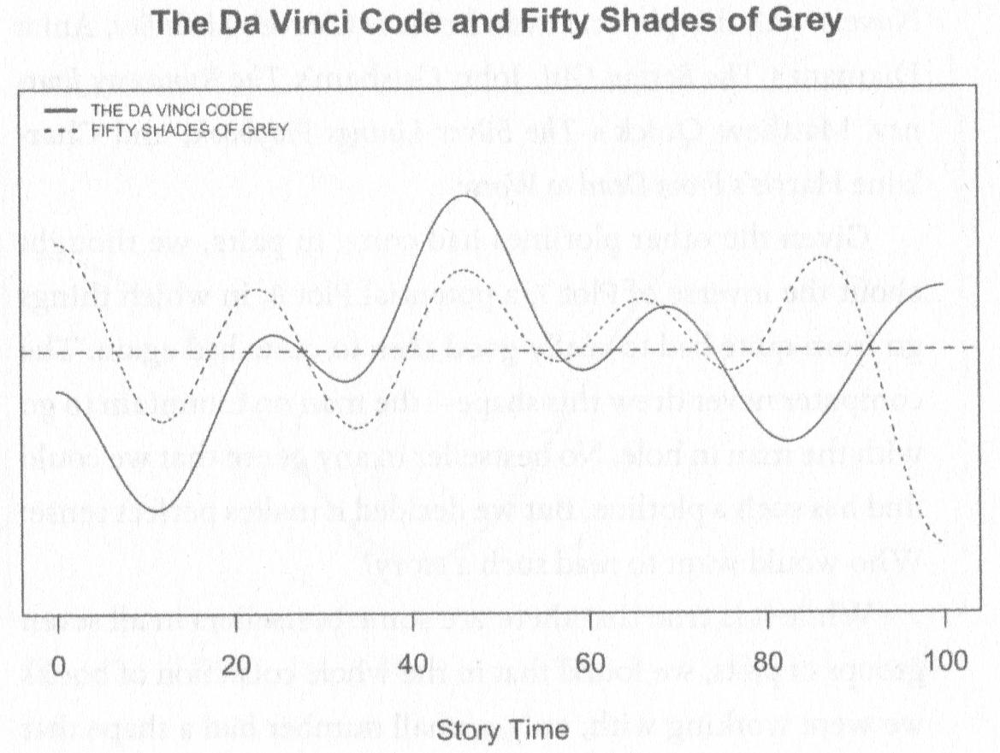
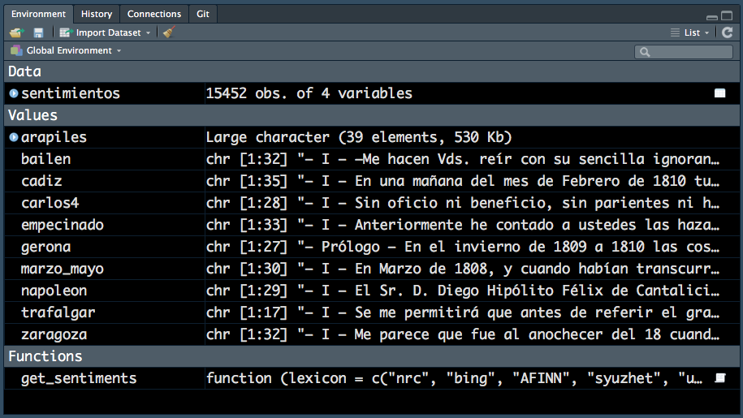
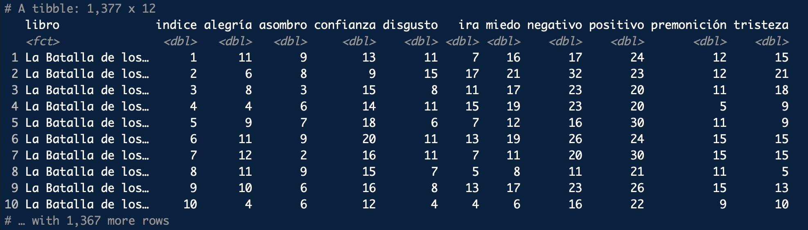
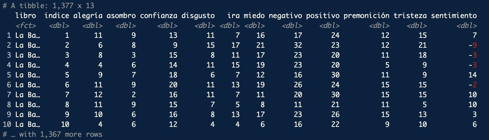
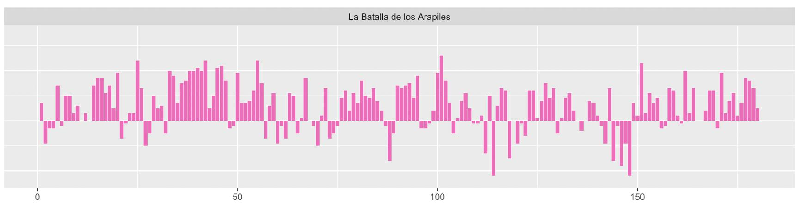
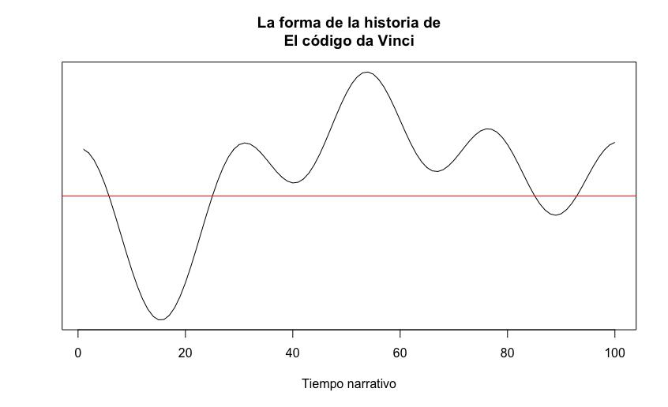
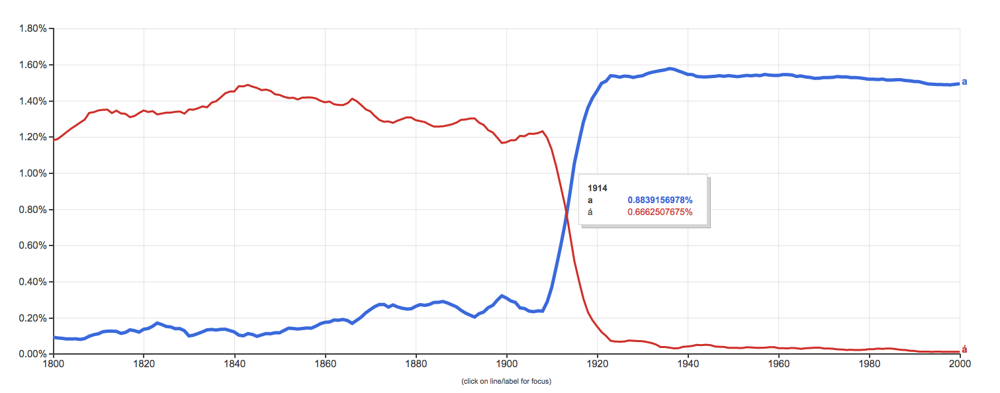

# La forma de las historias
## Introducción

El análisis de sentimientos, también llamado minería de opinión, son en una serie de técnicas informáticas que se utilizan para clasificar automáticamente un texto con un sentimiento positivo o negativo (Pang y Lee 2008) e incluso con alguna de las emociones básicas (Plutchik 1980). Si ya es difícil conseguir que dos personas se pongan de acuerdo acerca de si un texto es más o menos positivo, más o menos negativo, puesto que pueden influir aspectos culturales y la experiencia anterior de cada uno de ellos, mucho más difícil es que un ordenador pueda establecerlo, pues para una máquina un texto cualquiera es una mera secuencia de ceros y unos. A pesar de ello, un ejército de ingenieros, de estadistas y algún que otro lingüista están invirtiendo cantidades ingentes de tiempo y dinero para conseguirlo, pues sus clientes pueden ganar o perder mucho dinero si no son capaces de adaptarse con prontitud ante la reacción del público ante una campaña de publicidad o la mala acogida de un producto, por ejemplo.

En la actualidad hay dos aproximaciones: la del **aprendizaje automático** (_machine learning_) que consiste en entrenar un clasificador usando un algoritmo de aprendizaje supervisado a partir de una colección de textos anotados, donde cada texto habitualmente se representa como una _bolsa de palabras_ (`BoP` o `BoW` = _bag of words_) o secuencia de palabras (_n-grams_), en combinación con otro tipo de características semánticas que intentan modelar la estructura sintáctica de las frases, la intensificación, la negación, la subjetividad o la ironía.

El otro modo es el enfoque **semántico**. Este se caracteriza por el uso de diccionarios de términos o lexicones en los que cada palabra está marcada con una orientación semántica de polaridad u opinión. Estos sistemas, por lo general, lo que hacen es preprocesar el texto, para lo que lo dividen en palabras, pero como hay muchas que no tienen ningún valor, las llamadas palabras de función (artículos, conjunciones, preposiciones…), las eliminan comparando los textos contra una lista de palabras vacías (_stopwords_), y luego se ve si las palabras existen en el lexicón y qué valor de polaridad se les ha dado y, por medio de sumar y restar los valores positivos y negativos llega a establecerse una valencia para el sentimiento de un texto.

Ante estas posibilidades, en Estados Unidos una serie de investigadores empezaron a preguntarse si era posible aplicar estas técnicas a los textos literarios y qué conclusiones se podía sacar de los resultados (Mohammad 2013; Archer & Jockers 2016: 108). Uno de los sistemas mejor desarrollados es de Mathew L. Jockers y el paquete `syuzhet` desarrollado en el lenguaje `R`, aunque este investigador lo hace dentro del ámbito de la teoría de la forma de las historias (cfr. el vídeo de [Kurt Vonnegut](https://youtu.be/oP3c1h8v2ZQ); Booker 2004) y le sirve para explicar en qué reside el éxito de novelas como _Cincuenta sombras de Grey_ y cuán similares son la trayectoria de su historia esta última y _El Código Da Vinci_ de Dan Brown (Archie & Jockers 2016) (figura 11.1).

```{R 11-Sentimiento-01, echo = FALSE, out.width = '50%', fig.align='center', fig.cap = "Figura 11.1. Trayectorias de _The Da Vinci Code_ y _Fifty Shades of Grey_ según los análisis de Archer & Jockers (2016: 106)"}

```

El sistema que te voy a presentar de análisis no es perfecto. Se basa en contar en el texto que se examina cuántas palabras tienen un valor positivo y cuántas lo tienen negativa y con eso se establece una valencia que puede ser positiva o negativa (si es cero es neutra). No tiene en cuenta los modificadores que pueden cambiar totalmente el sentido de una frase. Una frase como _La película no estuvo mal_ sería negativa porque no tiene en cuenta que el no cambia el sentido de mal y le daría un valor positivo. Y lo mismo cabría decir de _Eso no estuvo bien_. Sería positiva para la máquina porque solo contemplaría bien, positivo, pero el no lo cambia en algo negativo. Esto puede ser un problema cuando se examinan textos muy breves, como los tweets o reseñas de sitios como TripAdvisor o Booking, pero para textos más complejos, como son los literarios no supone un problema (Mohammad 2011: 106). Además, se puede mejorar la técnica con el uso de bigramas y coocurrencias que has visto en un capítulo anterior.


## Análisis de sentimientos en español
### Preparar el entorno

Hasta donde sabemos, en español no se ha aplicado el análisis de sentimientos a textos literarios por el sencillo hecho de que no hay diccionarios disponibles ni investigadores interesados en el tema. Sin embargo, en [7PartidasDigital](https://7partidas.hypotheses.org/) hemos adaptado (traducido) al español los que tiene la librería tidytext que estás utilizando en este curso (Fradejas Rueda, en prensa) y creado otro que designamos `uva`.

Te voy a mostrar cómo hacer un análisis de sentimientos aplicado a textos literarios, aunque será muy básico. Todo el material que necesitas lo puedes cargar desde el repositorio del proyecto, así no habrá problemas con las letras que lleven diacríticos, un auténtico martirio en Windows.

Como de costumbre, inicia una nueva sesión de `RStudio` y carga las librerías básicas:

```
library(tidyverse)
library(tidytext)
```
```{r echo = FALSE}
library(tidyverse)
library(tidytext)
```
Al cargarse la librería `tidyverse`aparecerá un mensaje. No tienes que preocuparte de nada. Te  informa de la versión y de los paquetes que constituyen `tidyverse` y los pequeños conflictos que existen con otros paquetes. Nada importante.
El siguiente paso es cargar el diccionario que va a usar. Se encuentra en un repositorio externo y lo puedes cargar con

```{R}
sentimientos <- read_tsv("https://raw.githubusercontent.com/7PartidasDigital/AnaText/master/datos/diccionarios/sentimientos_2.txt",
                         col_types = "cccn",
                         locale = default_locale())
```

Esta orden necesita una pequeña explicación. La función `read_tsv()` permite leer una tabla cuyas columnas están separadas por tabuladores (_tab separated values_). El primer argumento es el fichero que contiene los datos. Con el argumento `col_types` le indicas que tipo de datos tiene cada una de las columnas de la tabla. Las tres primeras son caracteres, de ahí las tres `c`, la última tiene valores numéricos, por lo que le tienes que indicar `n`. El último argumento, `locale = default_locale()` es el repsonsable de que los ordenadores Windows no tengan problemas para leer las letras con diacríticos.

Examina la tabla `sentimientos`. Escribe en la consola

```{R eval = FALSE}
sentimientos
```

Aparecerá el comienzo de una gran tabla, de 15452 líneas y cuatro columnas:

```{R echo = FALSE}
sentimientos
```

Se trata de la versión reducida del diccionario de sentimientos que he desarrollado para usarlo con el paquete `tidytext`. Es una tabla que tiene cuatro columnas: `palabra`, `sentimiento`, `lexicon` y `valor`. En realidad, hay tres diccionarios diferentes construidos de manera diferente y con diferente número de palabras[^1].

La columna `palabra` contiene las diferentes palabras de cada uno de los diccionarios (el nombre de cada uno de ellos está recogido en la columna lexicon y puede ser `nrc`, `afinn` y `bing`). La columna valor es siempre `NA` para `nrc` y `bing`, y un valor numérico entre `-5` y `+5` para `afinn`. En cambio, `afinn` tiene siempre un valor `NA` en la columna sentimiento, mientras que en `bing` puede ser `negativo` o `positivo` y en `nrc` uno de estos diez valores: `positivo`, `negativo`, `ira`, `miedo`, `tristeza`, `disgusto`, `asombro`, `confianza`, `alegría`, `promonición`. Algunas palabras pueden tener en `nrc` varios valores, pero siempre relacionados. Fíjate en el cuadro anterior, `abandonar` está marcado como `miedo`, `negativo` y `tristeza`.

A continuación has de cargar una pequeña modificación de una de las funciones de `tidytext`. Lo tienes que hacer con `source`, que lo que hace es leer un script e interpretarlo como una función diseñada por el usuario. Cuando lo cargues, aparecerá en el la ventana **Environment** una división que dirá **Functions** y dentro de ella aparecerá `get_sentiments`. Esta es la función modificada para _burlar_ la que trae `tidytext` de serie.

```{R}
source("https://raw.githubusercontent.com/7PartidasDigital/R-LINHD-18/master/get_sentiments.R")
```

 ¡Ah! Cuando quieras analizar textos en inglés no cargues los diccionarios españoles ni `get_sentiments.R`. Utiliza los que trae de serie la librería `tidytext`. es decir, ignora los pasos anteriores.

### Cargar los textos

Ya tienes los dos elementos que necesitarás siempre que quieras hacer el análisis de sentimientos de un texto en español. Ahora tan solo tienes que cargar y preparar los textos de una manera especial. Vas a usar las diez entregas de la primera serie de los [Episodios Nacional](https://es.wikipedia.org/wiki/Episodios_nacionales#Primera_serie) de [Benito Pérez Galdós](https://es.wikipedia.org/wiki/Benito_P%C3%A9rez_Gald%C3%B3s).

Puesto que se trata de diez ficheros lo primero que necesitas es la lista de los nombres de los ficheros, que guardarás en `ficheros`. Basta con un vector de caracteres con los nombres de mismos:

Para cargar los diez ficheros no puedes usar un bucle `for` ya que te interesa mantener identificado cada uno de los episodios. Con lo que no hay otra que cargarlos uno a uno:

```{R}
trafalgar <- read_lines("https://raw.githubusercontent.com/7PartidasDigital/AnaText/master/datos/episodios/01_EN-01-01-Trafalgar.txt", locale = default_locale())
carlos4 <- read_lines("https://raw.githubusercontent.com/7PartidasDigital/AnaText/master/datos/episodios/02_EN-01-02-La_Corte_de_Carlos_IV.txt", locale = default_locale())
marzo_mayo <- read_lines("https://raw.githubusercontent.com/7PartidasDigital/AnaText/master/datos/episodios/03_EN-01-03-El_19_de_Marzo_y_el_2_de_Mayo.txt", locale = default_locale())
bailen <- read_lines("https://raw.githubusercontent.com/7PartidasDigital/AnaText/master/datos/episodios/04_EN-01-04-Bailen.txt", locale = default_locale())
napoleon <- read_lines("https://raw.githubusercontent.com/7PartidasDigital/AnaText/master/datos/episodios/05_EN-01-05-Napoleon_en_Chamartin.txt", locale = default_locale())
zaragoza <- read_lines("https://raw.githubusercontent.com/7PartidasDigital/AnaText/master/datos/episodios/06_EN-01-06-Zaragoza.txt", locale = default_locale())
gerona <- read_lines("https://raw.githubusercontent.com/7PartidasDigital/AnaText/master/datos/episodios/07_EN-01-07-Gerona.txt", locale = default_locale())
cadiz <- read_lines("https://raw.githubusercontent.com/7PartidasDigital/AnaText/master/datos/episodios/08_EN-01-08-Cadiz.txt", locale = default_locale())
empecinado <- read_lines("https://raw.githubusercontent.com/7PartidasDigital/AnaText/master/datos/episodios/09_EN-01-09-Juan_Martin_El_Empecinado.txt", locale = default_locale())
arapiles <- read_lines("https://raw.githubusercontent.com/7PartidasDigital/AnaText/master/datos/episodios/10_EN-01-10-La_Batalla_de_los_Arapiles.txt", locale = default_locale())
```

Cuando hayas acabado la carga, la ventana **Global Environment** tiene que tener un aspecto idéntico al de la figura 11.2.

```{R 11-Sentimiento-02, echo = FALSE, out.width = '75%', fig.align='center', fig.cap = "Figura. 11.2. La ventana **Global Enviroment** una vez cargados el diccionario `sentimientos`, los diez episodios y la función `get_sentiments`"}

```

Estos textos están ligeramente preparados, pues he unido todos los párrafos y cada elemento de cada uno de los vectores contiene un capítulo. Fíjate que todos, menos `gerona` empiezan por _- I -_. `gerona`lo hace con _- Prólogo -_. Podrías haberlo hecho, pero habría sido enredar un tanto la explicación y quiero que te centres en el análisis de sentimientos.

El siguente paso es crear un vector de caracteres con el título de cada entrega, llámalo, evidentemente, `titulo`. Créalo en el orden cronológico de publicación, así el análisis será mucho más interesante.

```{R}
titulos <- c("Trafalgar",
             "La Corte de Carlos IV",
             "El 19 de Marzo y el 2 de Mayo",
             "Bailen",
             "Napoleon en Chamartin",
             "Zaragoza",
             "Gerona",
             "Cadiz",
             "Juan Martin El Empecinado",
             "La Batalla de los Arapiles")
```

**Nota**. Para que lo veas con mayor facilidad he introducido un `intro` tras cada coma, pero puedes ponerlo en una sola línea, como esta:

```{R eval= FALSE}
titulos <- c("Trafalgar", "La Corte de Carlos IV", "El 19 de Marzo y el 2 de Mayo", "Bailen", "Napoleon en Chamartin", "Zaragoza", "Gerona", "Cadiz", "Juan Martin El Empecinado", "La Batalla de los Arapiles")
```

Lo siguiente es crear una lista, llamada `libros`, con todos los textos en el orden de publicación. Se crea con la función `list()` y cada uno de los elementos de la lista es cada uno de los vectores de caracteres que tienen el texto de cada entrega.

```{R}
libros <- list(trafalgar,
               carlos4,
               marzo_mayo,
               bailen,
               napoleon,
               zaragoza,
               gerona,
               cadiz,
               empecinado,
               arapiles)
```

Ahora has de crear una gran tabla, llámala `serie`, con todos los textos, con los títulos, los números de capítulo de cada una de ellas y cada una de las palabras divididas en palabras-token, es decir, todas convertidas en letras minúsculas y sin ningún signo de puntuación. Como es una labor que se ha de llevar a cabo con un bucle `for`, lo primero es inicializar la `tibble`, que llamarás `serie`, que guardará todo el material.

```{R}
serie <- tibble()
```

y a continuación el bucle con el que se creara una enorme tabla con cada una de las entregas de los diez primeros episodios nacionales:

```{R}
for(i in seq_along(titulos)) {
  limpio <- tibble(capitulo = seq_along(libros[[i]]),
                   texto = libros[[i]]) %>%
    unnest_tokens(palabra, texto) %>%
    mutate(libro = titulos[i]) %>%
    select(libro, everything())
  serie <- rbind(serie, limpio)
}
```

Aunque ya es un viejo conocido, te explico qué hace en cada línea de cada iteración. El controlador de vueltas es la longitud de `titulos`. Podrías usar `length(titulos)`, pero también `seq_along()`, es decir, sigue dando vueltas mientras que haya elementos en `titulos`. En la primera línea, guardará en `limpio` el número de los capítulos –`capitulo`– y el `texto` de cada `capitulo` que haya en `libros[[i]]`[^2], donde es `i` es uno de los diez posibles, de manera que, por ejemplo, `libros[[1]]` es `Trafalgar`, el cual tiene 17 capítulos. El contenido de `limpio` en esta primera línea del bucle es (no lo podrás ver en la consola):

```
# A tibble: 17 x 2
capitulo texto
  <int> <chr>
 1    1 "Se me permitirá que antes de referir el gran suceso…
 2    2 "En uno de los primeros días de Octubre de aquel año…
 3    3 "D. Alonso Gutiérrez de Cisniega pertenecía a una an…
 4    4 "«Señor Marcial –dijo ésta con redoblado furor: –si …
 5    5 "Para oponerse a la insensata determinación de su ma…
 6    6 "Recuerdo muy bien que al día siguiente de los pesco…
 7    7 "A la mañana siguiente se me preparaba una gran sorp…
 8    8 "No puedo describir el entusiasmo que despertó en mi…
 9    9 "Octubre era el mes, y 18 el día. De esta fecha no m…
10   10 "Al amanecer del día 20, el viento soplaba con mucha…
# ... with 7 more rows
```

En la siguiente línea lo que hace es dividir el texto del libro en palabras-token. Con lo que el contenido de `limpio` ahora en una tabla con el número de capítulo y cada una de las palabras del `libro[[i]]`.

```
# A tibble: 51,303 x 2
capitulo palabra
  <int> <chr>
 1 1   se
 2 1   me
 3 1   permitirá
 4 1   que
 5 1   antes
 6 1   de
 7 1   referir
 8 1   el
 9 1   gran
10 1   suceso
# ... with 51,293 more rows
```

En la siguiente la función `mutate()` crea una nueva columna llamada `libro`, que contendrá el título del episodio y lo extraerá del vector `titulos`.

```
# A tibble: 51,303 x 3
capitulo palabra libro
 <int>  <chr>    <chr>
 1   1  se        Trafalgar
 2   1  me        Trafalgar
 3   1  permitirá Trafalgar
 4   1  que       Trafalgar
 5   1  antes     Trafalgar
 6   1  de        Trafalgar
 7   1  referir   Trafalgar
 8   1  el        Trafalgar
 9   1  gran      Trafalgar
10   1  suceso    Trafalgar
# ... with 51,293 more rows
```

Después la función `select()` se encarga de crear la tabla intermedia definitiva, la cual solo tendrá las tres columnas del paso anterior, pero reorganizadas: `libro`, que guarda el título, `capitulo`, que contiene el número de cada capítulo, y `palabra`, cada uno de las palabra-token que constituyen cada capítulo.

```
# A tibble: 51,303 x 3
libro capitulo palabra
  <fct>    <int> <chr>
 1 Trafalgar 1   se
 2 Trafalgar 1   me
 3 Trafalgar 1   permitirá
 4 Trafalgar 1   que
 5 Trafalgar 1   antes
 6 Trafalgar 1   de
 7 Trafalgar 1   referir
 8 Trafalgar 1   el
 9 Trafalgar 1   gran
10 Trafalgar 1   suceso
# ... with 51,293 more rows
```

Como en este caso tienes diez entregas, la última línea del bucle se encarga de añadir a la tabla `serie`, que creaste antes de comenzarlo, cada una de las diez tablas intermedias que se han ido generando secuencialmente en `limpio`. Al final, tienes las diez novelas, divididas en palabras-token con indicación del `titulo` y del `capitulo` en el que aparecen. Es más, podrías leer las diez novelas leyendo la columna `palabra`, pues aún mantiene el orden del texto original, solo ha perdido los signos de puntuación y las mayúsculas. Es una tabla bastante grande, tiene 685 889 filas (palabras-token). Si te has leído los diez primeros Episodios ya sabes cuántas palabras tienen en total.

```
# A tibble: # A tibble: 685,889 x 3
libro capitulo palabra
  <fct>      <int> <chr>
 1 Trafalgar 1     se
 2 Trafalgar 1     me
 3 Trafalgar 1     permitirá
 4 Trafalgar 1     que
 5 Trafalgar 1     antes
 6 Trafalgar 1     de
 7 Trafalgar 1     referir
 8 Trafalgar 1     el
 9 Trafalgar 1     gran
10 Trafalgar 1     suceso
# ... with 685,879 more rows
```

El último paso previo es convertir la columna de los títulos –`libro`– en un `factor`. Ya lo has visto varias veces. La tabla, como acabas de ver, tiene más de medio millón de líneas, pero en la columna `libro` solo tienes diez posibles valores: el título de cada entrega. Manejar diez valores es más sencillo que más de medio millón que se repiten tan solo diez veces. Los factores es la manera de hacerlo, por lo que vas a reducir ese medio millón largo de repeticiones a tan solo diez valores. Hay varias maneras de hacerlo. La más sencilla es indicándole a `R` qué columna de la tabla `serie` quieres convertir en factores. Ya lo has visto hace tiempo, usas el signo `$`, de modo que `serie$libro` solo tendrá en cuenta esa columna de la tabla `serie`. La forma de hacerlo es con la función `factor()` que requiere saber qué es lo que debe convertir en factor y qué niveles debe tener –`levels`– y cómo ordenarlos –`rev()`–, pues los factores se ordenan por defecto alfabéticamente:

```
[1] "Bailen" "Cadiz"
[3] "El 19 de Marzo y el 2 de Mayo" "Gerona"
[5] "Juan Martin El Empecinado" "La Batalla de los Arapiles"
[7] "La Corte de Carlos IV" "Napoleon en Chamartin"
[9] "Trafalgar" "Zaragoza"
```
y te interesa mantener un cierto orden: el de publicación, aunque para complicar la cosa un poco, inverso, del más moderno al más antiguo. La orden es:

```{R}
serie$libro <- factor(serie$libro, levels = rev(titulos))
```

con lo que los títulos de la serie tendrán este orden:

```
[1] "La Batalla de los Arapiles" "Juan Martin El Empecinado"
[3] "Cadiz" "Gerona" "Zaragoza" "Napoleon en Chamartin"
[7] "Bailen" "El 19 de Marzo y el 2 de Mayo"
[9] "La Corte de Carlos IV" "Trafalgar"
```

### Primeros análisis

Ya tienes el material preparado. Una enorme tabla en la que están todas las palabras de las diez primeras novelas de los Episodios galdosianos. Es más, las sigues teniendo en el orden de lectura. Puedes comprobarlo con `serie$palabra[1:50]`. Si escribes esto en la consola

```{R eval = FALSE}
serie$palabra[1:50]
```

se imprimirán en la pantalla las 50 primeras palabras (aunque la primera será una _i_ que corresponde al número del capítulo)

```{R echo = FALSE}
serie$palabra[1:50]
```

Pero esto no dice nada. No te has tomado todo este trabajo para mal leer el texto. Sin embargo, antes de continuar es necesario que sepas el motivo por el cuál no se ha reorganizado el texto: a lo largo de estos análisis te interesará el tiempo narrativo, ver cómo progresa el relato y cómo cambia la carga emocional del texto.

Lo primero que vas a ver es cuántas palabras positivas y cuántas negativas hay en toda esta primera serie de los Episodios nacionales. Vas a utilizar el diccionario `nrc`. La ventaja de este es que, además de palabras positivas y negativas, indicará las palabras que transmiten alguna de las ocho emociones básicas. El código es:

```{R eval = FALSE}
serie %>%
  right_join(get_sentiments("nrc")) %>%
  filter(!is.na(sentimiento)) %>%
  count(sentimiento, sort = TRUE)
```

Tan pronto como se ejecute la orden aparecerán dos avisos y el resultado:

```{R echo = FALSE}
serie %>%
  right_join(get_sentiments("nrc")) %>%
  filter(!is.na(sentimiento)) %>%
  count(sentimiento, sort = TRUE)
```

### Explicación de la orden

La primera caja tras la del código imprime un `Warning`. No hay ningún problema. Este aviso te saldrá siempre que uses este sistema en español. Se debe a que ha buscado en la librería de `tidytext` los datos de `sentimientos`, y allí no los ha podido localizar porque no están ya que el paquete original no contempla la posibilidad de que se pueda hacer análisis de sentimiento en ninguna otra lengua. Sin embargo, los cargaste desde el fichero `.rda` y los tienes en **Global Enviroment**, por lo que seguirá funcionado. Tan solo te avisa de algo no ha ido como esperaba que fuera. En adelante no te mostraré este aviso, pero ten por seguro que a ti te saldrá.

La segunda caja te informa de que la función `rigth_join`se ha ejecutado con la variable `palabra` porque es la única variable –columna– que tienen en común `serie` y `sentimiento`. Siempre que uses la funciones `_join` aparecerá este aviso. En adelante tampoco te mostraré este aviso.

La tercera caja es el resultado. Lo que ha hecho el fragmento de código ha sido tomar el contenido del diccionario `nrc` y ver si la palabra se encuentra entre las palabras de `serie`. Si `serie` no tiene esa palabra, la añade, provisionalmente, a la tabla, e indica que no la hay con `NA`, tanto en `libro` como en capitulo, e incorpora a la derecha una nueva columna (`rigth_join`) con el `sentimiento` que esa palabra tenga marcado en `nrc`. El contenido, tras ejecutar la segunda línea –`right_join(get_sentiments("nrc"))`–, de la tabla provisional es:

```
A tibble: 174,367 x 4
  libro                   capitulo palabra     sentimiento
 1 NA                     NA       ábaco       confianza
 2 Trafalgar              11       abad        confianza
 3 Napoleon en Chamartin   9       abad        confianza
 4 Napoleon en Chamartin  22       abad        confianza
 5 Napoleon en Chamartin  22       abad        confianza
 6 Napoleon en Chamartin  23       abad        confianza
 7 NA                     NA       abanderar   negativo
 8 Trafalgar               1       abandonado  ira
 9 Trafalgar              12       abandonado  ira
10 Trafalgar              15       abandonado  ira
… with 174,357 more rows
```

La línea de `filter()` lo que le dice es que solo tome aquellas filas cuyo contenido en la columna `sentimiento` sea diferente de `NA` –`!is.na`–. La última línea, `count()`, lo que hace es contar cuántas veces aparece cada una de los sentimientos en la columna `sentimiento` y ordenarlas de mayor a menor de acuerdo con el número de ocurrencias –`sort = TRUE`–. El resultado con el diccionario `nrc` lo has visto un poco antes.

Si cambias el argumento de `get_sentiments()` de `nrc` a `bing`

```{R eval = FALSE}
serie %>%
  right_join(get_sentiments("bing")) %>%
  filter(!is.na(sentimiento)) %>%
  count(sentimiento, sort = TRUE)
```

el resultado será una tabla de 2 por 2 que te informará de cuántas palabras positivas y cuántas negativas hay en todo el corpus. (Te habrá salido el `Warning` y el aviso de `Joining`).
```{R echo = FALSE, warning = FALSE, message = FALSE}
serie %>%
  right_join(get_sentiments("bing")) %>%
  filter(!is.na(sentimiento)) %>%
  count(sentimiento, sort = TRUE)
```

Si lo comparas con los resultados de `nrc`, `bing` es muy pobre. `nrc` fue capaz de detectar 34934 palabras positivas y 26809 palabras negativas. Esto se debe a que la versión del diccionario `bing` aquí implementada es mucho más pobre.

## Visualización de los resultados

En varias ocasiones he mencionado que no se ha reorganizado el texto de los diez episodios porque puede ser interesante ver cómo evoluciona la valoración de sentimientos a lo largo de la trayectoria narrativa de cada una de ellas. La mejor manera de verlo es por medio de una gráfica que genera este fragmento de código (la explicación está un poco más abajo).

```{R, warning = FALSE, message = FALSE}
serie %>%
  group_by(libro) %>%
  mutate(recuento_palabras = 1:n(),
         indice = recuento_palabras %/% 500 + 1) %>%
  inner_join(get_sentiments("nrc")) %>%
  count(libro, indice = indice , sentimiento) %>%
  ungroup() %>%
  spread(sentimiento, n, fill = 0) %>%
  mutate(sentimiento = positivo - negativo, libro = factor(libro, levels = titulos)) %>%
  ggplot(aes(indice, sentimiento, fill = libro)) +
  geom_bar(stat = "identity", show.legend = FALSE) +
  facet_wrap(~ libro, ncol = 2, scales = "free_x")
```

En el eje vertical tienes la valencia emocional de los diez primeros episodios. Como es de suponer, los valores positivos corresponden a sentimientos positivos y los negativos a los negativos, es una obviedad. El valor del eje horizontal indica el número de la página, establecida en secuencias consecutivas de 500 palabras, por lo que puedes ver cómo varía la carga emocional según progresa el texto.

### Explicación del código

Ahora vamos a ver qué es lo que sucede en cada paso hasta llegar al gráfico anterior. Lo primero es agrupar los datos, que están recogidos en `serie`, de cada uno de los Episodios, porque quieres establecer la carga o valencia emotiva de cada uno de los libros, no de la serie como un todo, por lo tanto, has de usar `group_by(libro)`. Este primer paso crea una tabla intermedia invisible, como la que hay a continuación, en la que se informa de que la agrupación de la variable libro es de 10:

```
# A tibble: 685,889 x 3
# Groups: libro [10]
libro capitulo palabra
  <fct>  <int> <chr>
 1 Trafalgar 1 se
 2 Trafalgar 1 me
 3 Trafalgar 1 permitirá
 4 Trafalgar 1 que
 5 Trafalgar 1 antes
 6 Trafalgar 1 de
 7 Trafalgar 1 referir
 8 Trafalgar 1 el
 9 Trafalgar 1 gran
10 Trafalgar 1 suceso
# … with 685,879 more rows
```

En el siguiente creas, con `mutate()`, dos nuevas columnas. `recuento_palabras` e `indice`. La variable `recuento_palabras` lo único que hace es numerar una tras otra todas y cada una de las palabras de cada `libro`, y lo hace de `1` al valor de `n()` en cada `libro`. En la segunda parte de esta línea crea la columna `indice` en la que lo que hace es dividir el texto en segmentos de 500 palabras. Ya has usado otras técnicas en otros capítulos anteriores. Esta es una más. Así, de la palabra 1 a la 500, el índice es 1, de la 501 a la 1000, el índice es 2 y así sucesivamente hasta llegar al final. La forma de crear este índice es por medio de una división entera, cuyo operador es `%/%`. Se trata de una división en la que no se tiene en cuenta el resto.

La última entrega de la `serie` –_La batalla de Arapiles_–, por ejemplo, tiene 89629 palabras-token, si las divides en grupos de 500, el resultado sería 179.258, pero como no quieres perder ese .258 restante de palabras (son 129 palabras), le dices que quieres que la división sea exacta, pero como sospechas de que habrá un resto, le indicas que añada 1 al índice para marcar las palabras de ese resto. Esto ya lo has hecho antes, pero de otra forma, con `ceiling()`. Prueba cualquiera de las dos líneas siguientes en la consola:

```{R eval = FALSE}
89629 %/% 500 + 1
ceiling(89629/500)
```

Cualquiera de las dos ofrecerá el resultado

```{R echo = FALSE}
ceiling(89629/500)
```

El resultado intermedio de la función `mutate()`, no lo verás en la consola, es:

```
# A tibble: 685,889 x 5
# Groups: libro [10]
libro capitulo palabra recuento_palabras indice
  <fct>      <int> <chr>   <int> <dbl>
 1 Trafalgar 1     se        1   1
 2 Trafalgar 1     me        2   1
 3 Trafalgar 1     permitirá 3   1
 4 Trafalgar 1     que       4   1 
 5 Trafalgar 1     antes     5   1
 6 Trafalgar 1     de        6   1
 7 Trafalgar 1     referir   7   1
 8 Trafalgar 1     el        8   1
 9 Trafalgar 1     gran      9   1
10 Trafalgar 1     suceso   10   1
# … with 685,879 more rows
```

mientras que las seis última líneas de la enorme tabla serían

```
La Batalla de los Arapiles 39 sin   89624 180
La Batalla de los Arapiles 39 nada  89625 180
La Batalla de los Arapiles 39 y     89626 180
La Batalla de los Arapiles 39 lo    89627 180
La Batalla de los Arapiles 39 tuvo  89628 180
La Batalla de los Arapiles 39 todo  89629 180
```

En los dos recuadros anteriores tienes, por un lado, las diez primeras palabras de _Trafalgar_, que se encuentran en el primer capítulo y forman el primer grupo de 500 palabras de esa entrega (podríamos decir que en la primera página). En el segundo recuadro tienes que seis últimas palabras de _La batalla de Arapiles_, que son las palabras 685884 a 685889, que se encuentran en el capítulo 39 y forman el grupo (es decir, la página) 180 de esa novela.

En la siguiente línea lee el diccionario de sentimientos `nrc` y añade la columna `sentimiento` con los distintos valores que puede tener. De nuevo es un estadio interno que no es visible, pero te muestro el aspecto que tiene:

```
# A tibble: 170,065 x 6
# Groups: libro [10]
libro capitulo palabra recuento_palabras indice sentimiento
  <fct>  <int> <chr>  <int> <dbl> <chr>
 1 Trafalgar 1 testigo  14   1   confianza
 2 Trafalgar 1 palabras 17   1   ira
 3 Trafalgar 1 palabras 17   1   negativo
 4 Trafalgar 1 infancia 20   1   alegría
 5 Trafalgar 1 infancia 20   1   positivo
 6 Trafalgar 1 terrible 36   1   disgusto
 7 Trafalgar 1 terrible 36   1   ira
 8 Trafalgar 1 terrible 36   1   miedo
 9 Trafalgar 1 terrible 36   1   negativo
10 Trafalgar 1 terrible 36   1   premonición
# … with 170,055 more rows
```

Todas las palabras son del capítulo primero, de la primera página y tan solo las palabras 14, 17, 20 y 36 ha obtenido una valencia (valor de la columna sentimiento). El siguiente paso es contar cuántas palabras de cada emoción hay en cada página (el número de `indice`). La tabla interna es:

```
# A tibble: 13,738 x 4
# Groups: libro [10]
libro indice sentimiento n
  <fct>                      <dbl> <chr>     <int>
 1 La Batalla de los Arapiles 1    alegría     11
 2 La Batalla de los Arapiles 1    asombro      9
 3 La Batalla de los Arapiles 1    confianza   13
 4 La Batalla de los Arapiles 1    disgusto    11
 5 La Batalla de los Arapiles 1    ira          7
 6 La Batalla de los Arapiles 1    miedo       16
 7 La Batalla de los Arapiles 1    negativo    17
 8 La Batalla de los Arapiles 1    positivo    24
 9 La Batalla de los Arapiles 1    premonición 12
10 La Batalla de los Arapiles 1    tristeza    15
# … with 13,728 more rows
```

Puedes ver que en la página 1 (`indice`) de _La batallas de Arapiles_ hay 24 palabras positivas y 17 negativas y, puedes ver, además, cuántas palabras que denotan alegría, confianza, disgusto, ira, miedo, promonición y tristeza. Puesto que ya has realizado los cálculos para cada `libro`, tienes que deshacerte del grupo con `ungroup()`.

La siguiente línea –`spread(sentimiento, n, fill = 0)`– lo que hace es crear una tabla en la que se resumen y recopilan los valores –`n`– de cada uno de los sentimientos –`sentimiento`– para cada página –`indice`– de cada una de las entregas de la serie –`libro`–. Puesto que puede haber sitios en los que no hay palabras para un sentimiento determinado y evitar que `R` introduzca un `NA`, que es el valor que asigna por defecto cuando faltan valores, usas el argumento `fill = 0`. De esta manera te aseguras de que después podrás hacer las operaciones matemáticas necesarias. El aspecto interno de esta tabla, que de nuevo no es visible, es:

```{R 11-Sentimiento-04, echo = FALSE, out.width = '80%', fig.align='center'}

```

Ahora va a realizar unos cálculos. Establecerá la valencia emocional de cada página. Lo hará restando a las palabras positivas –`positivo`– las negativas –`negativo`– y las va a guardar en la columna `sentimiento`. Además, va a reorganizar los títulos –`libro`– por orden de publicación –`levels = titulos`–. El aspecto de la tabla interna final, que pasará a `ggplot()` para dibujar la gráfica, es:


```{R 11-Sentimiento-05, echo = FALSE, out.width = '80%', fig.align='center'}

```

Ya tienes los datos preparados para dibujar la gráfica. Puesto que lo que ofrece la tabla anterior son las diez primeras páginas de _La batalla de Arapiles_, entresaco el gráfico que acabará dibujando para este episodio (figura 11.3). Fíjate que las páginas 2, 3, 4 y 6 tienen una valencia negativa, lo que se refleja en la gráfica con barras descendentes, mientras que las paginas 1, 5, 7,8, 9 y 10 son todas positivas.


```{R 11-Sentimiento-06, echo = FALSE, out.width = '80%', fig.align='center', fig.cap = "Fig. 11.3. Evolución del sentimiento en _La batalla de Arapiles_"}

```


El dibujo la gráfica para cada uno de los diez episodios se encargaron las tres últimas líneas de esta larga orden

```{R eval=FALSE}
serie %>%
  . . . . . %>%
  ggplot(aes(indice, sentimiento, fill = libro)) +
  geom_bar(stat = "identity", show.legend = FALSE) +
  facet_wrap(~ libro, ncol = 2, scales = "free_x")
```

La primera línea de la orden de `ggplot()` selecciona los valores que va a utilizar para dibujar la gráfica: `indice`, que lo tendrás en el eje horizontal, y que corresponde a cada una de las páginas, con lo que puedes ver el tiempo narrativo; y `sentimiento` que es el valor que tendrás en el eje vertical. El tercer argumento, `fill = libro`, coloreará las barras de acuerdo con el valor de `libro`, es decir, establecerá diez colores. Si no lo haces así, te ofrecerá una gráfica en blanco y negro.

```{R message = FALSE, warning = FALSE, echo= FALSE}
serie %>%
  group_by(libro) %>%
  mutate(recuento_palabras = 1:n(), indice = recuento_palabras %/% 500 + 1) %>%
  inner_join(get_sentiments("nrc")) %>%
  count(libro, indice = indice , sentimiento) %>%
  ungroup() %>%
  spread(sentimiento, n, fill = 0) %>%
  mutate(sentimiento = positivo - negativo, libro = factor(libro, levels = titulos)) %>%
  ggplot(aes(indice, sentimiento)) +
  geom_bar(stat = "identity", show.legend = FALSE) +
  facet_wrap(~ libro, ncol = 2, scales = "free_x")
```

La función `geom_bar()` ya es una vieja conocida, por lo que no creo que tenga que explicarte casi nada. El argumento `stat = "identity"` establece que la altura de las barras equivalga al valor de `sentimiento`; mientras que `show.legend = FALSE` evita que se imprima en el margen derecho una leyenda explicativa como puedes ver en la imagen que hay a continuación. Es información redundante porque la ofreces en la banda gris que hay encima de cada gráfica.

```{R message = FALSE, warning = FALSE, , echo= FALSE}
serie %>%
  group_by(libro) %>%
  mutate(recuento_palabras = 1:n(),
         indice = recuento_palabras %/% 500 + 1) %>%
  inner_join(get_sentiments("nrc")) %>%
  count(libro, indice = indice , sentimiento) %>%
  ungroup() %>%
  spread(sentimiento, n, fill = 0) %>%
  mutate(sentimiento = positivo - negativo, libro = factor(libro, levels = titulos)) %>%
  ggplot(aes(indice, sentimiento, fill = libro)) +
  geom_bar(stat = "identity", show.legend = TRUE) +
  facet_wrap(~ libro, ncol = 2, scales = "free_x")
```

La última línea es la que se encarga de montar en una sola gráfica los diez gráficos y así poder comparar con facilidad. El último argumento `scales = "free_x"` es para que estreche aquellas gráficas cuyos valores del eje horizontal vayan más allá del que ofrezca en menor número de valores. En este caso, _Trafalgar_ tiene menos páginas que _La batalla de Arapiles_, que tiene más de 175 (en realidad 180).

## Unos resultados más
Te estarás preguntando, pero cuáles son las palabras que más contribuyen al sentimiento de la serie. Lo vamos a averiguar con el diccionario bing, aunque es un poco más pobre. Todo se reduce a establecer qué palabras son las que se consideran positivas y cuáles negativas. Ya lo has hecho antes. Así que reutiliza un poco de código:
```{R message = FALSE, warning = FALSE}
recuenta_palabras_bing <- serie %>%
  inner_join(get_sentiments("bing")) %>%
  count(palabra, sentimiento, sort = TRUE)
```
Esta orden creará una tabla llamada `recuenta_palabras_bing` con tres columnas: `palabra`, `sentimiento` y `n`. En la primera tendrás las palabras, en la segunda si la considera positiva o negativa y en la última el número de veces que aparece cada una de ellas. Puedes ver el resultado, tan solo el comienzo, si escribes en la consola

```{R eval = FALSE}
recuenta_palabras_bing 
```

que responderá con la parta inicial de la tabla:


```{R echo = FALSE}
recuenta_palabras_bing 
```

Apenas puedes apreciar los resultados, puesto que presenta, a causa de la frecuencia de aparición, las cuatro primeras palabras positivas y las seis negativas. Ya sabes cómo puedes ofrecerlo de manera gráfica como estas

```{R echo = FALSE, message = FALSE}
recuenta_palabras_bing %>%
  group_by(sentimiento) %>%
  top_n(25) %>%
  ggplot(aes(reorder(palabra, n), n, fill = sentimiento)) +
  geom_bar(stat = "identity", show.legend = FALSE) +
  facet_wrap(~sentimiento, scales = "free_y") +
  labs(y = "Contribución al sentimiento", x = NULL) +
  coord_flip()
```

que se consiguen con unas pocas líneas de código

```{R eval = FALSE}
recuenta_palabras_bing %>%
  group_by(sentimiento) %>%
  top_n(25) %>%
  ggplot(aes(reorder(palabra, n), n, fill = sentimiento)) +
  geom_bar(stat = "identity", show.legend = FALSE) +
  facet_wrap(~sentimiento, scales = "free_y") +
  labs(y = "Contribución al sentimiento", x = NULL) +
  coord_flip()
```

Creo que a estas alturas no necesitas que te explique qué sucede en cada línea.

-----

## La librería `syuzhet`
La gráficas de la figura 11.3 no permite ver cuál es la línea (curva) de la trayectoria de la historia de cada una de las entregas de los diez primeros Episodios Nacionales. La manera de verlo es como la de la gráfica de la figura 11.1. He analizado con el sistema que te mostraré más adelante una de las dos novelas que Archer & Jockers (2016) procesaron para esa gráfica. Podrás ver que las curvas son semejantes.


```{R 11-Sentimiento-01a, echo = FALSE, out.width = '50%', fig.align='center'}

```

```{R 11-Sentimiento-09, echo = FALSE, out.width = '50%', fig.align='center', fig.cap = "Trayectorias de _The Da Vinci Code_ y _Fifty Shades of Grey_ según los análisis de Archer & Jockers (2016: 106) (superior) y de _El conde da Vinci_ en español (inferior)"}

```

Evidentemente no pueden ser totalmente iguales las líneas de ambas gráficas por el sencillo hecho de que Archer y Jockers utilizan un diccionario de valencias totalmente diferente al utilizado por mí en este análisis. Lo importante es la similitud de trazos.

-----

###_Los cuatro jinetes del Apocalipsis_

En lo que resta de capítulo te voy a mostrar cómo hacerlo con una novela de Vicente Blasco Ibáñez, _Los cuatro jinetes del Apocalipsis_.

```{R echo = FALSE}
rm(list=ls())
```

Cierra y reinicia *RStudio*, es para asegurarte de que no hay nada que pueda provocar un error de ejecución, e instala la librería `syuzhet` con

 ```
install.packages("syuzhet")
```

aunque solo utilizarás una única función, e invoca las librerías necesarias:

```{R}
library(tidyverse)
library(tidytext)
library(syuzhet)
```

El siguiente paso es cargar el fichero `diccionarios.rda` que contiene los diccionarios de sentimientos y la función `get_sentiments.R` para poder hacer al análisis de sentimientos:

```{R}
load("~/Dropbox/AnaText/datos/diccionarios.rda")
source("~/Dropbox/AnaText/codigo/get_sentiments.R")
```

Ahora has de cargar el texto de la novela que quieras analizar. En el directorio `datos/textos` tienes tres novelas de tres autores españoles:

* _Los jinetes del Apocalipsis_ de Vicente Blasco Ibáñez (`cuatro_jinetes_apocalipsis.txt`)
* _Los pazos de Ulla_ de Emilia Pardo Bazán (`pazos_ulloa.txt`)
* _La Regenta_ de Leopoldo Alas Clarín (`LaRegenta.txt`).

La instrucción para cargar el texto es:

```{R}
texto_entrada <- read_lines("~/Dropbox/AnaText/datos/textos/cuatro_jinetes_apocalipsis.txt")
```
Habrá aparecido en **Global Enviroment** el objeto `texto_entrada` y te informará de que es un `Large character` que tiene `2105 elements` y que ocupa `933.7 Kb`. Si tienes esta información, la carga ha sido correcta. Pero vas a comrpobarlo. Escribe en la consola

```{R}
head(texto_entrada)
```

Esta orden ha impreso los seis primeros elementos del vector `texto_entrada`. Para ver los seis últimos, basta con

```{R}
tail(texto_entrada)
```

Ahora tienes que convertirlo en una `tibble` para poder dividirlo en palabras-token y hacer los primeros cálculos. Llamarás a esta primera tabla `texto_analizar`

```{R}
texto_analizar <- tibble(texto = texto_entrada)
```

Lo que acabas de hacer es convertir en una `tibble()` lo que tenías en `texto_entrada` y le has indicado que la variable (columna) se llame `texto`. El resultado lo puedes ver con[^3]

```{R}
texto_analizar
```

Una vez convertido en tabla, en la que cada fila es un párrafo, vas a dividirlo en palabras-token –`palabra`–; crear un índice que equivaldrá a una página –`pagina`– de texto de un libro impreso; establecerá qué palabras son positivas, cuáles negativas e incluso marcará aquellas que tengan una carga emotiva; las recontará –`sentimiento`– y creará una tabla interna con la valencia para cada página. Por último, convertirá los números de la columna negativo en número negativos. El código para hacer todo esto es:

```{R, warning= FALSE, message = FALSE}
texto_analizar <- texto_analizar %>%
  unnest_tokens(palabra, texto) %>%
  mutate(pagina = (1:n()) %/% 400 + 1) %>%
  inner_join(get_sentiments("nrc")) %>%
  count(sentimiento, pagina = pagina) %>%
  spread(sentimiento, n, fill = 0) %>%
  mutate(negativo = negativo*-1)
```

Al final tendrás en `texto_analizar` una tabla que puedes ver con
```{R}
texto_analizar
```

### Explicación del código
En cada uno de los pasos habrías obtenido lo siguiente, pero no lo puedes ver, salvo que fueras ejecutando línea a línea.

Con la línea `unnest_tokens(palabra, texto)` divides el texto en palabras-token y se mantienen en el mismo orden que en el texto. Recuerda que las mayúsculas se pasan a minúsculas y los signos de puntuación se eliminan.

```
# A tibble: 131,337 x 1
palabra
<chr>
1 vicente
2 blasco
3 ibáñez
4 los
5 cuatro
6 jinetes
7 del
8 apocalipsis
9 1916
10 primera
# ... with 131,327 more rows
```
Con `mutate(pagina = (1:n()) %/% 400 + 1)` se crea la numeración de `pagina`. Esta vez consideramos que son tan solo 400 palabras por página. Tú puedes decidir la longitud que mejor te convenga.

```
# A tibble: 131,337 x 2
palabra      pagina
<chr>        <dbl>
1 vicente      1
2 blasco       1
3 ibáñez       1
4 los          1
5 cuatro       1
6 jinetes      1
7 del          1
8 apocalipsis  1
9 1916         1
10 primera     1
# ... with 131,327 more rows
```

Con `inner_join(get_sentiments("nrc"))` se agrega la columna con el sentimiento que tiene cada cada palabra (si es que está en el diccionario)

```
# A tibble: 37,021 x 3
  palabra pagina sentimiento
  <chr>    <dbl>  <chr>
1 jardín      1   alegría
2 jardín      1   positivo
3 tarde       1   negativo
4 tarde       1   tristeza
5 pequeño     1   negativo
6 jardín      1   alegría
7 jardín      1   positivo
8 impaciencia 1   negativo
9 cita        1   asombro
10 cita       1   negativo
# ... with 37,011 more rows
```
Con `count(sentimiento, pagina = pagina)` calculas –`n`– de cuántas palabras de cada sentimiento o emoción –`sentimiento`– hay en cada página –`pagina`–.

```
# A tibble: 3,283 x 3
  sentimiento pagina  n
  <chr>       <dbl>   <int>
1 alegría      1       11
2 alegría      2        7
3 alegría      3        6
4 alegría      4       11
5 alegría      5        8
6 alegría      6        7
7 alegría      7        6
8 alegría      8       11
9 alegría      9       13
10 alegría    10        8
# ... with 3,273 more rows
```
Con `spread(sentimiento, n, fill = 0)`lo que haces en convertir en `0` aquellas casillas en las que hay `NA`. Y, finalmente, con `mutate(negativo = negativo*-1)` conviertes la variable `negativo` en números negativos.

El siguiente paso es calcular la puntuación para cada página. Se trata de sumar a los valores de positivos los de negativos y quedarte con una tabla con el valor final para cada página. El código es:

```{R}
puntuacion <- texto_analizar %>%
  mutate(sentimiento = positivo+negativo) %>%
  select(pagina, sentimiento)
```

El resultado lo puedes ver tecleando en la consola y se imprimirá el comienzo del resultado
```{R}
puntuacion
```

Ahora puedes representarlo gráficamente. Leer tablas de números no suele ser muy ilustrativo. El siguiente código dibujará una gráfica de barras.
```{R}
ggplot(data = puntuacion, aes(x = pagina, y = sentimiento)) +
  geom_bar(stat = "identity", color = "midnightblue") +
  theme_minimal() +
  ylab("Sentimiento") +
  xlab("Tiempo narrativo") +
  ggtitle(expression(paste("Sentimiento en ",
                           italic("Los cuatro jinetes del Apocalipsis")))) +
  theme(legend.justification=c(0.91,0), legend.position=c(1, 0))
```

No creo que haya que explicar qué hace en cada línea esta expresión de `ggplot()`. Todo lo que contiene lo has visto en otras ocasiones.

Cada barra equivale a una página con lo que puedes ver qué partes de la novela son más positivas y cuáles menos. Ten en cuenta que el resultado depende en gran medida de la riqueza del diccionario, cuantas más palabras tenga, más fino y preciso podrá ser el análisis. Sin embargo, no queda claro, hay mucho ruido y no puedes ver con nitidez la curva de la línea por la que se transita la narración. Aquí es donde entra la magia del paquete `syuzhet`, del que solo vas a utilizar una función `get_dct_transform()` que necesita saber de donde obtener los datos, en tu caso de `puntaución$sentimiento` y una serie de argumentos bastante crípticos, porque el autor del paquete no los explica suficientemente. Este es el código por medio del que actúa `get_dct_tranformor()`:

```{R}
texto_trans <- get_dct_transform(puntuacion$sentimiento,
                                 low_pass_size = 10,
                                 #x_reverse_len = nrow(puntuacion),
                                 scale_range = TRUE)
```

Aquí lo que aplica es una transformación matemática empleada para transformar, valga la redundancia, entre el dominio del tiempo (o espacial) y el dominio de la frecuencia que se conoce como [Transformada de Fourier](https://es.wikipedia.org/wiki/Transformada_de_Fourier). Las matemáticas que hay detrás son de infarto, salvo para quien tenga un excelente dominio de este ámbito. Sin embargo, el programador de la librería nos excusa de las matemáticas y nos ofrece la magia del resultado. Toma los valores que has guardado en `puntuacion` y realizará los cálculos. El más importante es el `low_pass_size`, por defecto está programado como `5`, he constatado que variando los valores el mejor parece ser `10`. Los resultados los ofrecerá en un rango ente `-1` y `1`, de ahí el argumento `scale_range = TRUE`. El argumento `x_reverse_len` tiene por valor por defecto `100`, y lo que hace es presentar el resultado en una escala de `0` a `100`. Quizá sea un poco más complejo después ver a qué parte del texto se refiere, por lo que si se indica que use como valor el número de páginas `nrow(puntuacion)`, entonces es más sencillo seguir la pista de dónde se produce cada cambio en el texto, como se puede ver en la gráfica de la figura 11.12.

El resultado de esta función es un vector de números. Teclea en la consola
```{R}
texto_trans
```

Tienes los datos que corresponde a cada página, y aunque se puede barruntar a que porción del texto corresponde, `ggplot()` necesita saberlo con precisión, por lo que has de crear una nueva tabla que informe a `ggplot()` de a qué página, o segmento, corresponde qué valor. Es tan sencillo como usar esta expresión:

```{R}
texto_trans <- tibble(pagina = seq_along(texto_trans), ft = texto_trans)
```

Lo que hace esta orden es convertir `texto_trans` en una `tibble` con dos columnas: `pagina` y `ft`. `pagina` se rellena con el número de la página a la que corresponde cada valor de ft, que es el resultado obtenido por los cálculos de la función `get_dct_tranform()`, por lo que basta con un sencillo `seq_along(texto_trans)`, que lo que hace es rellenar las casillas de `pagina` con un número consecutivo que va desde `1` hasta la cantidad total de elementos (líneas) que haya en `ft`. El resultado lo puedes ver con
```{R}
texto_trans
```

Ahora estás en disposición de dibujar la gráfica. Para ello necesitas esta pequeña sección de código de `ggplot()`:

```{R}
ggplot(texto_trans, aes(x = pagina, y = ft)) +
  geom_bar(stat = "identity", alpha = 0.8,
           color = "aquamarine3", fill = "aquamarine3") +
  theme_minimal() +
  labs(x = "Tiempo narrativo",
       y = "Transformación Valorada del Sentimiento") +
  ggtitle(expression(paste("Forma de la historia de ",
                           italic("Los cuatro jinetes del Apocalipsis"))))
```

Creo que todo lo que hace esta orden de `ggplot()` ya lo sabes porque lo has visto en los capítulos anteriores. Lo único raro esta vez es el contenido de `ggtitle(`). Aquí he querido que el título de la obra esté en cursiva, como mandan los cánones. Para conseguirlo hay que complicar la cosa con la función `expression()`, y lo que pretende es unir una primera parte "Forma de la historia de " y el título en cursiva, de ahí que use `paste()` para unirlos, y antes del título use `italic()`.

Pero a veces, quizá sea mejor una sencilla gráfica de líneas que se obtiene con la función `plot()` básica de `R`. El código para obtenerla es:

```{R}
plot(texto_trans,
     type="l",
     yaxt='n',
     ylab="",
     xlab ="Tiempo narrativo",
main = "La forma de la historia:\n
Los cuatro jinetes del Apocalipsis")
abline(h = 0.0, col = "red")
```

Es muy sencilla. La función `plot()` es la responsable de dibujar la gráfica. El primer argumento es el lugar de donde ha de obtener los datos, en este caso `texto_trans`. El argumento `type ="l"` determina que dibuje una línea fina (hay otras posibilidades, échale una ojeada a la ayuda de `plot`). `yaxt='n'` y `ylab=""` evitan que se imprima información en el eje vertical (cuestión estética). Prueba a reimprimir el gráfico sin estos dos argumentos. `xlab=` sirve para darle una etiqueta más clara al eje horizontal (si no lo hubiera puesto había impreso `pagina`, que es el nombre de la variable). `main =""` sirve para poner el nombre principal del gráfico. Verás que al final de la línea hay un \n, eso lo que le indica que es que lo siguiente lo imprima en una nueva línea. La última instrucción `abline()` sirve para trazar una línea horizantal, de ahí el argumento `h =`. El `0.0` le indica que debe trazarla en el punto donde esté el valor `0.0` (no lo puedes ver porque le has dicho que no lo imprima con `yaxt='n'`. `col = "red"` creo que es evidente: el color de la línea.


### Bibliografía

Archie & Jockers 2016: Jodie Archer y Matthew L. Jockers, The Bestseller code. Penguin Books, 2017.

Booker 2004: Christopher Booker, The Seven Basic Plots. Why we tell stories. Londres: Bloomsbury.

Mohammad 2011: Saif Mohammad, «From Once Upon a Time to Happily Ever After: Tracking Emotions in Novels and Fairy Tales», en Proceedings of the 5th ACL-HLT Workshop on Language Technology for Cultural Heritage, Social Sciences, and Humanities, Portland, pp. 105–114, [Acceso al artículo]

Pang & Lee 2008: Bo Pangs y Lillian Lee, «Opinion mining and sentiment analysis», en Foundations and Trends in Information Retrieval, 2: pp. 1-135. [Acceso a pre-print]

Pluichick 1980: Robert Plitchick, «A general psychoevolutionary theory of emotion», en Emotion: Theory, research, and experience, 1(3): 3-33. [Acceso al artículo]


[^1]: Los tres diccionarios o lexicones de sentimientos que contemplamos son: `AFINN` de [Finn Årup Nielsen](http://www2.imm.dtu.dk/pubdb/views/publication_details.php?id=6010), `bing` de [Bing Liu y colaboradores](https://www.cs.uic.edu/~liub/FBS/sentiment-analysis.html) y `nrc` de [Saif Mohammad and Peter Turney](http://saifmohammad.com/WebPages/NRC-Emotion-Lexicon.htm). Hay un cuarto, `syuzhet`, de Matthew L. Jockers, que forma parte de la librería para `R syuzhet`. Volveré sobre este más adelante.

[^2]: El doble corchete `[[i]]` es la forma más sencilla de extraer datos de una lista.

[^3]: La edición que electrónica que he localizado mantiene algunas peculiaridades acentuales de principios del siglo XX como es la acentuación de la preposición _a_. El cambio de norma se produjo en 1908, pero tardó en arraigar, como puede verse en el gráfico generado con [Google N-gram](https://books.google.com/ngrams/graph?content=a%2C%C3%A1&year_start=1800&year_end=2000&corpus=10&smoothing=3&share=&direct_url=t1%3B%2Ca%3B%2Cc0%3B.t1%3B%2C%C3%A1%3B%2Cc0#t1%3B%2Ca%3B%2Cc0%3B.t1%3B%2C%C3%A1%3B%2Cc1)



